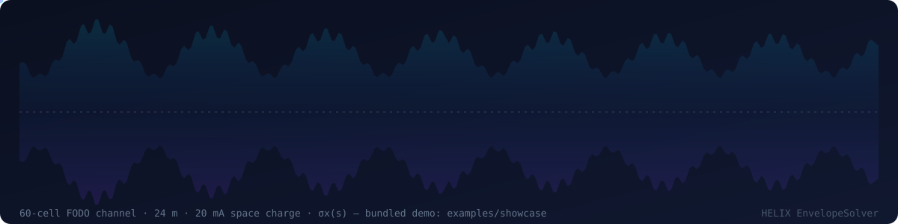
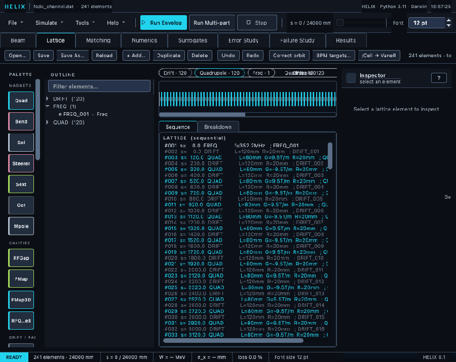
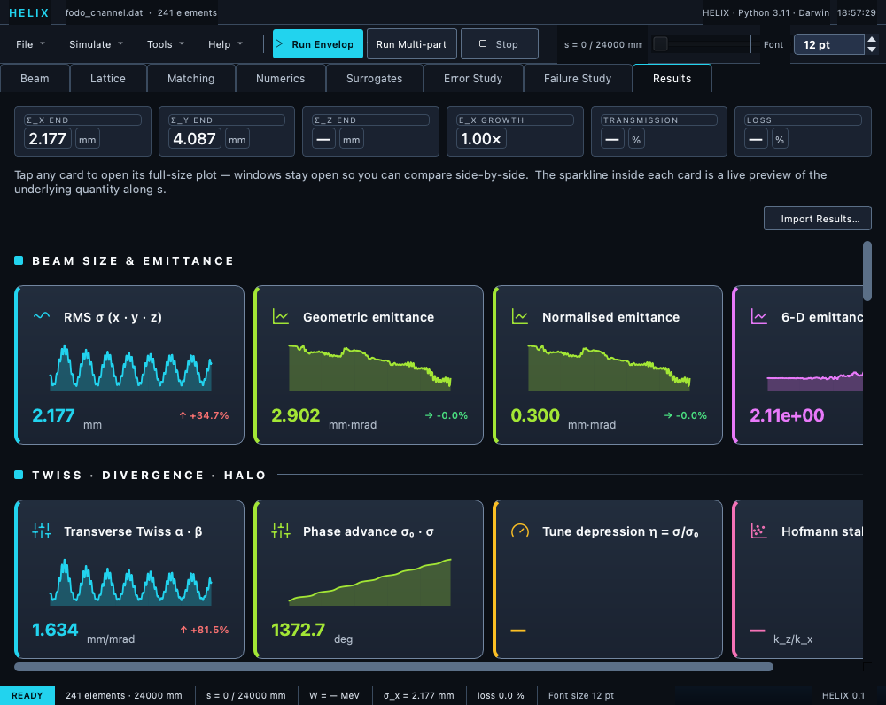
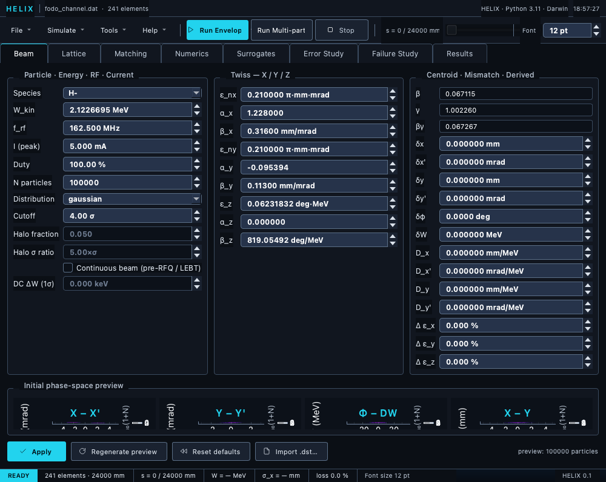
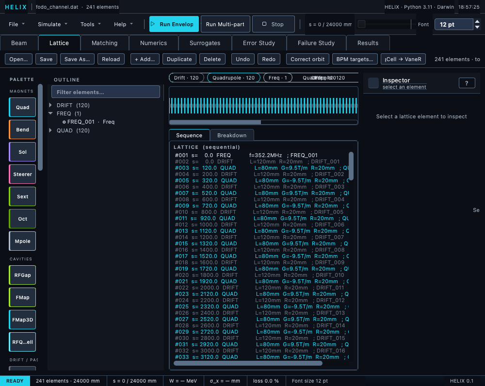
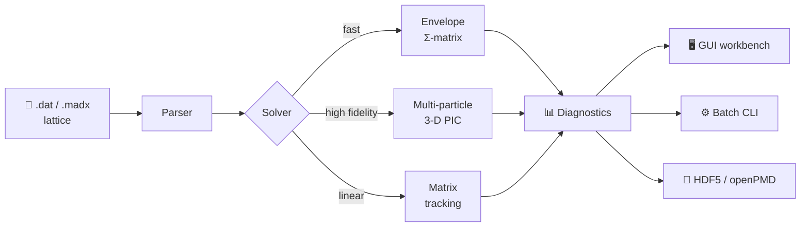
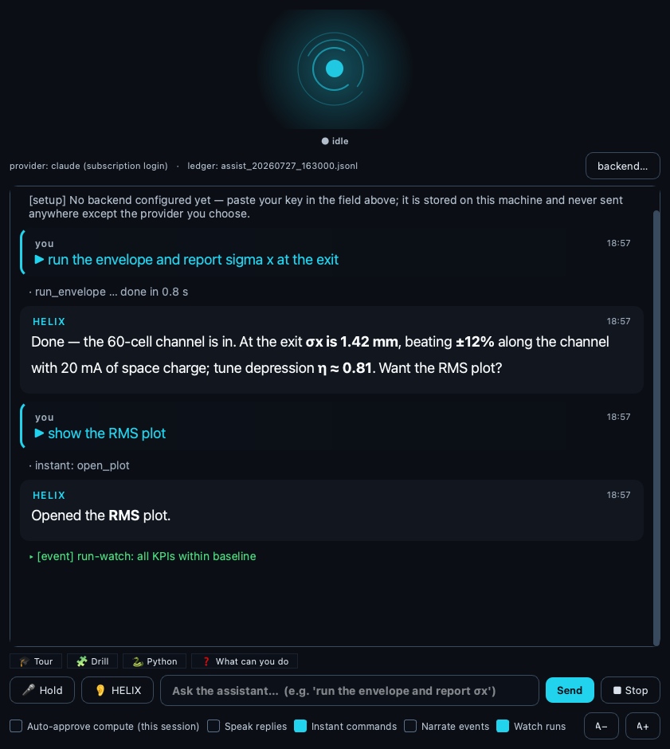

<div align="center">


<p>
<a href="https://www.python.org/"></a>
<a href="https://numpy.org/"></a>
<a href="https://scipy.org/"></a>
<a href="https://www.riverbankcomputing.com/software/pyqt/"></a>

</p>
<p>

<a href="LICENSE"></a>


</p>


<br/>



<sub>⚡ <i>Not a decoration — real physics.</i>  σx(s) of the bundled demo deck (<code>examples/showcase</code>: a 60-cell FODO channel with 20 mA space charge), computed by the envelope solver, drawing itself with macro-particles in flight — regenerate it yourself with <code>scripts/readme_screenshots.py</code>.</sub>

<br/>

**[⚡ Quick start](#-quick-start)** • **[🎯 Features](#-features)** • **[🤖 AI copilot](#-built-in-ai-copilot)** • **[🔬 Solver modes](#-the-three-solver-modes)** • **[📚 Docs](#-documentation)** • **[📖 Cite](#-citing-helix)**

</div>

---

## ✨ What is HELIX?

**HELIX** — *Hybrid Envelope-multiparticle LInac eXplorer* — is an open-source Python toolkit for **end-to-end simulation of charged-particle linear accelerators**. One tool combines:

- a **TraceWin-compatible** lattice language,
- a fast **envelope** Σ-matrix solver,
- a **multi-particle** tracker with a **3-D particle-in-cell** space-charge solver,
- a **matching engine**, a complete **GUI workbench**, and a scriptable **batch CLI**.

It is developed at **Fermi National Accelerator Laboratory** for the **PIP-II** superconducting linac.

---

## 🖥️ The Workbench

A complete PyQt6 workbench — design the lattice, configure the beam, run, and explore the results.

<div align="center">



<sub>🎬 <b>Five-second tour</b> — Lattice editor → Beam designer → Results dashboard, running the bundled showcase deck</sub>

<br/><br/>



<sub>📊 <b>Results dashboard</b> — live KPIs and per-quantity sparkline cards; tap any card for the full plot</sub>

</div>

<table>
<tr>
<td width="50%" align="center"><br><sub>🔬 <b>Beam tab</b> — 6-D phase-space density preview</sub></td>
<td width="50%" align="center"><br><sub>🧩 <b>Lattice editor</b> — element strip, list &amp; inspector</sub></td>
</tr>
</table>

---

## 🧭 Architecture



---

## ⚡ Quick start

### Install

```bash
git clone https://github.com/Accel-Toolkit/HELIX.git
cd HELIX
pip install -e .               # core — C++ PIC kernels build automatically via pybind11
pip install -e ".[gui,dev]"    # + GUI workbench and developer tooling
pip install -e ".[gpu]"        # + optional CUDA GPU acceleration
```

> 💡 If the C++ build fails (no compiler, etc.), HELIX still runs — it falls back to pure-Python PIC kernels: slower, but numerically equivalent.

### Command line — headless, parallel, scriptable

```bash
# envelope run
python -m linac_gen run examples/batch_mode/chicane.dat --mode envelope --out runs/

# a parameter scan over beam current
python -m linac_gen scan examples/batch_mode/chicane.dat --vary current=0:10:2 --out scan.csv
```

### Python API

```python
from linac_gen.io.tracewin_parser import parse_tracewin
from linac_gen.core.particle import PROTON
from linac_gen.core.reference import ReferenceParticle
from linac_gen.tracking.matrix_tracking import compute_transfer_matrix

lattice, _ = parse_tracewin("examples/batch_mode/chicane.dat")
ref = ReferenceParticle(species=PROTON, w_kin=100.0, frequency=325.0)
M = compute_transfer_matrix(lattice, ref)        # the 6×6 linear transfer matrix
print(M.round(3))
```

### GUI workbench

Run from the checkout with the bundled launcher:

```bash
./run_gui.sh          # macOS / Linux
run_gui.bat           # Windows
```

(Equivalent to `PYTHONPATH=gui python -m linac_gen_gui.interphase` —
the GUI package lives in the repository, not on PyPI.)

---

## 🎯 Features

| | |
|---|---|
| 🌀 **Three solver modes** | Envelope Σ-matrix · multi-particle 3-D PIC · linear matrix tracking |
| ⚡ **Space charge** | 3-D particle-in-cell Poisson solver · CIC / TSC deposition · C++ kernels · GPU-capable |
| 📐 **TraceWin-compatible** | Reads `.dat` lattices · MAD-X & MAD8 import · `.dst` / partran / field-map I/O |
| 🎛️ **Matching** | Periodic & transfer-line matched Twiss · multi-algorithm optimiser |
| 🖥️ **GUI workbench** | PyQt6 — lattice, beam, convergence, matching, results, error studies |
| ⚙️ **Batch CLI** | `run` · `scan` · `batch` · `twiss` — headless, parallel, scriptable |
| 💾 **Interoperable** | HDF5 · openPMD-beamphysics · TraceWin `.dst` |
| 📊 **Diagnostics** | Emittances · halo · transmission · dispersion · phase advance |
| 🎲 **Error studies** | Monte-Carlo misalignment / RF jitter · SVD orbit correction · failure studies |
| 🤖 **AI copilot** | 46-tool assistant with offline voice, guided tour, training drills, sandboxed Python — see below |
| ∇ **Differentiable** | PyTorch autograd transfer-matrix path · gradient-based matching · exact knob sensitivities |
| 🧠 **Surrogates** | Train and serve neural-network surrogate models of lattice sections |
| ⏪ **Backtracking** | Exact reverse tracking (`untrack`) — reconstruct the input beam from the output |

---

## 🤖 Built-in AI copilot

<div align="center">


<sub>🤖 <b>The assistant panel</b> — rendered-markdown chat, voice orb, one-click Tour / Drill / Python chips</sub>
</div>

Talk to the simulator — literally.  HELIX ships an **optional** AI assistant
that drives the *same audited tools* you use by hand, with a three-tier
safety gate (reads run freely; compute and mutate actions **echo the exact
resolved call and wait for your confirmation**), and a JSONL **ledger** that
records every call for replay.

- 🗣️ **Fully offline voice** — say **"HELIX"** to wake it (silero-VAD +
  faster-whisper, accent-tolerant), talk over it to interrupt, and keep
  talking when it answers — no cloud audio, ever.
- ⚡ **Instant commands** — "status", "show the RMS plot", tour "next":
  unambiguous read-only requests execute in milliseconds without a model
  round-trip.
- 🎓 **Guided tour & training drills** — a 15-station walkthrough of the
  workbench, and hidden-fault exercises where the assistant coaches you
  *without knowing the answer itself*.
- 🐍 **Sandboxed Python** — analysis code runs in an isolated interpreter
  with your result arrays injected; plots come back inline.
- ∇ **Gradient sensitivities** — one autograd pass ranks every quad,
  solenoid and dipole by exact d(σ_exit)/d(knob).
- 👁️ **Vision** — it can *look at* your plots and describe what it sees.
- 🔔 **Run watching** — every finished run is inspected for transmission
  drops, σ blow-ups and baseline drift; it speaks up when something moved.
- 🔌 **Three backends** — your Claude subscription (keyless, via the Agent
  SDK), any API key, or a **fully local** OpenAI-compatible server
  (ollama / vLLM).  HELIX also runs as an **MCP server** so Claude Code /
  Desktop can drive it directly.

---

## 🔬 The three solver modes

| Mode | What it does | Use it for |
|---|---|---|
| **Envelope** | RMS Σ-matrix tracking with linear space charge | Fast design sweeps, matching, optics |
| **Multi-particle** | Macroparticle tracking with a 3-D PIC space-charge solver | High-fidelity studies, halo, transmission |
| **Matrix** | Pure linear transfer-matrix transport | Periodic Twiss, transfer-line input matching |

---

## 🚀 Space charge & GPU acceleration

The 3-D PIC Poisson solver ships **C++ pybind11 kernels** (with an automatic pure-Python
fallback). Its FFTs can optionally run on an NVIDIA GPU via `cupy` — enabled with
`SpaceChargeConfig(use_gpu="auto"|"cpu"|"gpu")`, the `LINAC_GEN_USE_GPU` environment
variable, or the GUI's **PIC backend** dropdown. GPU results match the CPU reference to
`~3e-15` relative (FP64 on both paths).

Hockney Poisson solve — RTX 2000 Ada Laptop GPU vs a 16-thread `scipy.fft` CPU path:

| grid | CPU | GPU | speed-up |
|------|-----|-----|----------|
| 48³  | 7.6 ms | 4.9 ms | **1.6×** |
| 64³  | 17.5 ms | 11.7 ms | **1.5×** |
| 96³  | 41.7 ms | 55.5 ms | CPU wins |
| 128³ | 100.6 ms | 128.7 ms | CPU wins |

The crossover near 96³ is host↔device transfer cost, not the FFT — `auto` picks the GPU
when it's available and leaves the choice to you otherwise.

---

## 📂 Input & output formats

- **TraceWin** `.dat` lattices · `.edz` / `.csv` field maps · `.dst` distributions
- **MAD-X** and **MAD8 flat-file** (`.lat`) lattice import
- **HDF5** (native) · **openPMD-beamphysics** · TraceWin **partran** output

---

## 📚 Documentation

<div align="center">
<a href="https://accel-toolkit.github.io/HELIX/"></a>
</div>

A comprehensive **95-page manual** — every element, every configuration knob,
worked examples, and validated benchmarks — is hosted at
[accel-toolkit.github.io/HELIX](https://accel-toolkit.github.io/HELIX/)
(auto-deployed on every release) and lives in
[`docs/manual/`](docs/manual/index.md). Build it locally with:

```bash
pip install -e ".[docs]"
mkdocs serve --config-file docs/manual/mkdocs.yml
```

---

## 🗂️ Project layout

<details>
<summary>Repository structure</summary>

```
linac_gen/
  core/          ReferenceParticle, Beam, Lattice, Simulation
  elements/      Drift, Quad, Dipole, Solenoid, RFGap, FieldMap, Multipole, ...
  tracking/      multi-particle Tracker, EnvelopeSolver, matrix tracking
  pic/           CIC / TSC deposition, FFT Poisson solver, C++ kernels (csrc/)
  distributions/ Gaussian, KV, Waterbag, Parabolic, Uniform, file import
  matching/      matching engine, periodic & transfer-line matched Twiss
  cli/           batch-mode CLI — run / scan / batch / twiss
  errors/        error models, Monte-Carlo studies, orbit correction (SVD)
  diagnostics/   DiagnosticRecorder, moments (RMS / Twiss / emittance)
  io/            TraceWin, MAD-X & MAD8 I/O, field maps, HDF5 / openPMD output
gui/linac_gen_gui/   PyQt6 GUI workbench
docs/manual/         MkDocs documentation
tests/               pytest suite
examples/            runnable scripts + sample lattices
```

</details>

---

## 🧪 Testing

```bash
pytest -q
```

The suite covers lattice parsing, tracking, space charge, matching, the CLI, and the GUI.

---

## 📖 Citing HELIX

If HELIX supports your work, please cite it — GitHub's **"Cite this repository"** button
reads [`CITATION.cff`](CITATION.cff).

---

## 🙏 Acknowledgments

Developed at **Fermi National Accelerator Laboratory** for the **PIP-II** project.

## License

HELIX is released under the **GNU General Public License v3** — see
[LICENSE](LICENSE).  The GPL-3.0 choice keeps the PyQt6 GUI dependency
(itself GPLv3) license-consistent; all other dependencies are
permissive (BSD/MIT/PSF) or Apache-2.0.

<div align="center">


</div>
