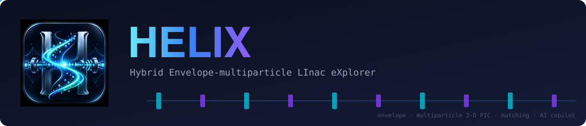
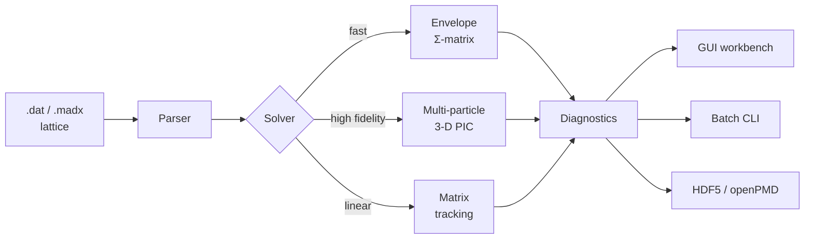
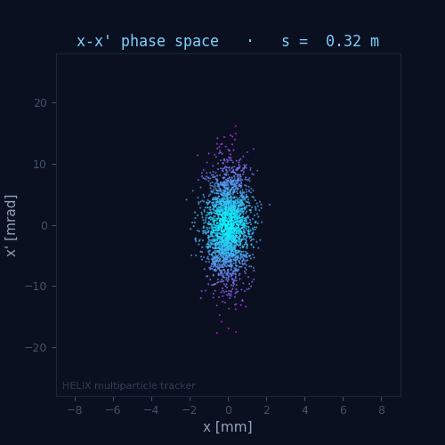

<div align="center">



<p>
<a href="https://accel-toolkit.github.io/HELIX/"></a>
<a href="https://github.com/Accel-Toolkit/HELIX/releases"></a>
<a href="LICENSE"></a>

</p>

</div>

**HELIX** — *Hybrid Envelope-multiparticle LInac eXplorer* — is an open-source
Python toolkit for end-to-end simulation of charged-particle linear
accelerators. It combines a TraceWin-compatible lattice language, a fast
envelope Σ-matrix solver, a multi-particle tracker with a 3-D
particle-in-cell space-charge solver, a matching engine, a PyQt6 workbench,
and a scriptable batch CLI.

HELIX is developed at Fermi National Accelerator Laboratory for the PIP-II
superconducting linac.

[Documentation](https://accel-toolkit.github.io/HELIX/) ·
[Video tutorials](https://accel-toolkit.github.io/HELIX/tutorials.html) ·
[Quick start](#quick-start) ·
[Citing HELIX](#citing-helix)

<div align="center">


<sub>σ<sub>x</sub>(s) of the bundled demo deck (<code>examples/showcase</code>: a 60-cell FODO
channel with 20 mA space charge), computed by the envelope solver and drawn with
macro-particles in flight. Regenerate it with <code>scripts/readme_screenshots.py</code>.</sub>

</div>

## The workbench

A complete PyQt6 workbench for designing the lattice, configuring the beam,
running, and exploring results.

<div align="center">


<sub>Lattice editor, beam designer and results dashboard, running the bundled showcase deck.</sub>

<br/><br/>


<sub>Results dashboard — live KPIs and per-quantity sparkline cards; select any card for the full plot.</sub>

</div>

<table>
<tr>
<td width="50%" align="center"><br><sub>Beam tab — 6-D phase-space density preview</sub></td>
<td width="50%" align="center"><br><sub>Lattice editor — element strip, list and inspector</sub></td>
</tr>
</table>

A 13-episode [video course](https://accel-toolkit.github.io/HELIX/tutorials.html)
(about three hours) covers installation, every tab of the workbench in depth,
space-charge physics, and the built-in assistant, plus a bonus tour of the manual.

## Architecture



## Quick start

### Install

```bash
git clone https://github.com/Accel-Toolkit/HELIX.git
cd HELIX
pip install -e .               # core — C++ PIC kernels build automatically via pybind11
pip install -e ".[gui,dev]"    # + GUI workbench and developer tooling
pip install -e ".[gpu]"        # + optional CUDA GPU acceleration
```

If the C++ build fails (no compiler, for example), the install still succeeds
and HELIX falls back to pure-Python PIC kernels: slower, but numerically
equivalent. The install log prints a warning when that happens; set
`LINAC_GEN_REQUIRE_CPP=1` to make a failed kernel build fatal instead.

### One-click setup

After cloning, run the setup file for your operating system. It creates an
isolated `.venv` next to the repository, installs HELIX with the GUI,
smoke-tests the result, and offers to launch:

| OS | Command |
|---|---|
| Windows | double-click `setup.bat` |
| macOS | double-click `setup.command` |
| Linux | `./setup.sh` |

Re-running the same file after a `git pull` updates the install in place. The
scripts never touch your system Python — everything lands in the repository's
own `.venv`, which `run_gui.sh` and `run_gui.bat` pick up automatically.

### Windows notes

- **No compiler needed.** Without Visual Studio Build Tools the C++ kernels
  are skipped with a warning and HELIX uses the pure-Python fallback.
- **OpenMP.** With MSVC, the kernels build against `vcomp` (`/openmp`) by
  default so they coexist with PyTorch's bundled Intel OpenMP. Set
  `LINAC_GEN_OPENMP_LLVM=1` before installing to opt into `/openmp:llvm`
  (faster nested loops, but it aborts at the first space-charge kick in any
  process that also imports torch — only for torch-free deployments).
- **Console encoding.** `set PYTHONUTF8=1` is recommended on stock (cp1252)
  consoles; HELIX degrades gracefully without it.
- **Long paths.** PyTorch's licence tree is deep enough to exceed the Windows
  260-character `MAX_PATH` limit, so a venv under a long directory can fail
  with `WinError 206` while installing torch. Use a short checkout path
  (for example `C:\hx\`) or enable `LongPathsEnabled` in the registry.
- **GPU.** PyTorch wheels on PyPI are CPU-only on Windows. Install a CUDA
  build first, for example
  `pip install torch --index-url https://download.pytorch.org/whl/cu126`
  (Pascal-generation GPUs need cu126; cu128 dropped them), then
  `pip install -e ".[gpu]"` for the CuPy PIC-FFT path. The `[gpu]` extra
  bundles the CUDA runtime via pip (`cupy-cuda12x[ctk]`), so no system CUDA
  Toolkit installation is required.

### Command line

```bash
# envelope run
python -m linac_gen run examples/batch_mode/chicane.dat --mode envelope --out runs/

# a parameter scan over beam current
python -m linac_gen scan examples/batch_mode/chicane.dat --vary current=0:10:2 --out scan.csv
```

### Python API

```python
from linac_gen.io.tracewin_parser import parse_tracewin
from linac_gen.core.particle import PROTON
from linac_gen.core.reference import ReferenceParticle
from linac_gen.tracking.matrix_tracking import compute_transfer_matrix

lattice, _ = parse_tracewin("examples/batch_mode/chicane.dat")
ref = ReferenceParticle(species=PROTON, w_kin=100.0, frequency=325.0)
M = compute_transfer_matrix(lattice, ref)        # the 6×6 linear transfer matrix
print(M.round(3))
```

### GUI workbench

Run from the checkout with the bundled launcher:

```bash
./run_gui.sh          # macOS / Linux
run_gui.bat           # Windows
```

**File → New Project…** (Ctrl+N) creates a ready-to-run project — blank
lattice, imported `.dat`, or a bundled example — with its own folder and
`runs/` output directory.

This is equivalent to `PYTHONPATH=gui python -m linac_gen_gui.interphase`; the
GUI package lives in the repository, not on PyPI.

## Features

| | |
|---|---|
| **Three solver modes** | Envelope Σ-matrix · multi-particle 3-D PIC · linear matrix tracking |
| **Space charge** | 3-D particle-in-cell Poisson solver · CIC / TSC deposition · C++ kernels · GPU-capable |
| **TraceWin-compatible** | Reads `.dat` lattices · MAD-X, MAD8 and Elegant `.lte` import · `.dst` / partran / field-map I/O |
| **Matching** | Periodic and transfer-line matched Twiss · multi-algorithm optimiser |
| **GUI workbench** | PyQt6 — Beam · Lattice · Matching · Numerics · Surrogates · Param Study · Error Study · Failure Study · Results |
| **Batch CLI** | `run` · `scan` · `batch` · `study` · `twiss` · `mo` · `failures` · `backtrack` · `match` · `assist` — headless, parallel, scriptable |
| **Interoperable** | HDF5 · openPMD-beamphysics · TraceWin `.dst` |
| **Diagnostics** | Emittances · halo · transmission · dispersion · phase advance |
| **Error studies** | Monte-Carlo misalignment / RF jitter · SVD orbit correction · failure studies |
| **AI assistant** | Optional 53-tool assistant with offline voice, guided tour, training drills, sandboxed Python |
| **Differentiable** | PyTorch autograd transfer-matrix path · gradient-based matching · exact knob sensitivities |
| **Surrogates** | Train and serve neural-network surrogate models of lattice sections |
| **Backtracking** | Exact reverse tracking (`untrack`) — reconstruct the input beam from the output |

## Built-in AI assistant

<div align="center">


<sub>The assistant panel — rendered-markdown chat, voice orb, and one-click Tour / Drill / Python actions.</sub>
</div>

HELIX ships an optional AI assistant that drives the same audited tools you use
by hand, under a three-tier safety gate: reads run freely, while compute and
mutate actions echo the exact resolved call and wait for your confirmation.
Every call is recorded in a JSONL ledger that can be replayed without a model.

- **Offline voice.** Say "HELIX" to wake it (silero-VAD and faster-whisper,
  accent-tolerant), talk over it to interrupt, and keep talking when it
  answers. No audio leaves the machine.
- **Instant commands.** Unambiguous read-only requests — "status", "show the
  RMS plot", tour "next" — execute in milliseconds without a model round-trip.
- **Guided tour and training drills.** A 15-station walkthrough of the
  workbench, and hidden-fault exercises where the assistant coaches you
  without knowing the answer itself.
- **Sandboxed Python.** Analysis code runs in an isolated interpreter with
  your result arrays injected; plots come back inline.
- **Gradient sensitivities.** One autograd pass ranks every quadrupole,
  solenoid and dipole by exact d(σ_exit)/d(knob).
- **Vision.** It can read your plots and describe what it sees.
- **Run watching.** Finished runs are inspected for transmission drops, σ
  blow-ups and baseline drift, and the assistant reports what moved.
- **Three backends.** A Claude subscription (keyless, via the Agent SDK), an
  API key, or a fully local OpenAI-compatible server (ollama, vLLM). HELIX
  also runs as an MCP server, so external agents can drive it directly.

## The three solver modes

<div align="center">


<sub>The showcase bunch in x–x′ phase space, station by station, from the multi-particle tracker.</sub>
</div>

| Mode | What it does | Use it for |
|---|---|---|
| **Envelope** | RMS Σ-matrix tracking with linear space charge | Fast design sweeps, matching, optics |
| **Multi-particle** | Macroparticle tracking with a 3-D PIC space-charge solver | High-fidelity studies, halo, transmission |
| **Matrix** | Pure linear transfer-matrix transport | Periodic Twiss, transfer-line input matching |

## Space charge and GPU acceleration

The 3-D PIC Poisson solver ships C++ pybind11 kernels with an automatic
pure-Python fallback. Its FFTs can optionally run on an NVIDIA GPU via `cupy`,
selected with `SpaceChargeConfig(use_gpu="auto"|"cpu"|"cuda"|"mps")`, the
`LINAC_GEN_USE_GPU` environment variable, or the GUI's PIC backend dropdown.
CUDA and CPU results agree to `~1e-10` relative on the field (FP64 on both
paths; the residual comes from `cupy` and `numpy` evaluating `arctan`/`arcsinh`
slightly differently, amplified through the integrated Green's function).

Hockney Poisson solve — RTX 2000 Ada Laptop GPU against a 16-thread
`scipy.fft` CPU path:

| Grid | CPU | GPU | Speed-up |
|------|-----|-----|----------|
| 48³  | 7.6 ms | 4.9 ms | 1.6× |
| 64³  | 17.5 ms | 11.7 ms | 1.5× |
| 96³  | 41.7 ms | 55.5 ms | CPU faster |
| 128³ | 100.6 ms | 128.7 ms | CPU faster |

The crossover near 96³ is host-to-device transfer cost, not the FFT, so the
GPU path is not always the faster one. `auto` uses the CUDA path whenever
`cupy` is importable and the CPU path otherwise; it never selects the
experimental FP32 `mps` (Apple Silicon) backend, which has to be requested
explicitly. Pin the choice with `use_gpu="cpu"` or `"cuda"` when you care
about which path runs.

## Input and output formats

- **TraceWin** `.dat` lattices · `.edz` / `.csv` field maps · `.dst` distributions
- **MAD-X** and **MAD8 flat-file** (`.lat`) lattice import
- **Elegant** (`.lte`) lattice import — `line=(...)` beamlines, element templates, `ematrix` → explicit-matrix element; import-only (HELIX never writes `.lte`)
- **HDF5** (native) · **openPMD-beamphysics** · TraceWin **partran** output

## Documentation

The manual covers every element, every configuration knob, worked examples and
validated benchmarks. It is hosted at
[accel-toolkit.github.io/HELIX](https://accel-toolkit.github.io/HELIX/),
deployed on every release, and lives in [`docs/manual/`](docs/manual/index.md).
Build it locally with:

```bash
pip install -e ".[docs]"
mkdocs serve --config-file docs/mkdocs.yml
```

The [video tutorials](https://accel-toolkit.github.io/HELIX/tutorials.html) are
a 13-episode deep-dive course covering the same ground in about three hours,
plus a bonus episode touring this manual.

## Project layout

<details>
<summary>Repository structure</summary>

```
linac_gen/
  core/          ReferenceParticle, Beam, Lattice, Simulation
  elements/      Drift, Quad, Dipole, Solenoid, RFGap, FieldMap, Multipole, ...
  tracking/      multi-particle Tracker, EnvelopeSolver, matrix tracking
  pic/           CIC / TSC deposition, FFT Poisson solver, C++ kernels (csrc/)
  distributions/ Gaussian, KV, Waterbag, Parabolic, Uniform, file import
  matching/      matching engine, periodic & transfer-line matched Twiss
  cli/           batch-mode CLI — run / scan / batch / study / twiss / mo / failures / backtrack / match / assist
  errors/        error models, Monte-Carlo studies, orbit correction (SVD)
  diagnostics/   DiagnosticRecorder, moments (RMS / Twiss / emittance)
  io/            TraceWin, MAD-X, MAD8 & Elegant I/O, field maps, HDF5 / openPMD output
gui/linac_gen_gui/   PyQt6 GUI workbench
docs/manual/         MkDocs documentation
tests/               pytest suite
examples/            runnable scripts + sample lattices
```

</details>

## Testing

```bash
pytest -q
```

The suite is about 3,900 tests covering lattice parsing, tracking, space
charge, matching, the CLI and the GUI. Long integration tests (`slow` marker)
run by default. For a quicker first check — recommended on Windows — deselect
them and skip the GUI suite:

```bash
pytest -q -m "not slow" --ignore=tests/gui
```

## Citing HELIX

If HELIX supports your work, please cite it. GitHub's "Cite this repository"
button reads [`CITATION.cff`](CITATION.cff).

## Acknowledgments

Developed at Fermi National Accelerator Laboratory for the PIP-II project.

We thank an external user whose detailed Windows 11 installation report drove
a round of portability fixes: build fallback, OpenMP coexistence with PyTorch,
and locale-independent I/O.

## License

HELIX is released under the GNU General Public License v3; see
[LICENSE](LICENSE). The GPL-3.0 choice keeps the PyQt6 GUI dependency (itself
GPLv3) licence-consistent; all other dependencies are permissive (BSD, MIT,
PSF) or Apache-2.0.
