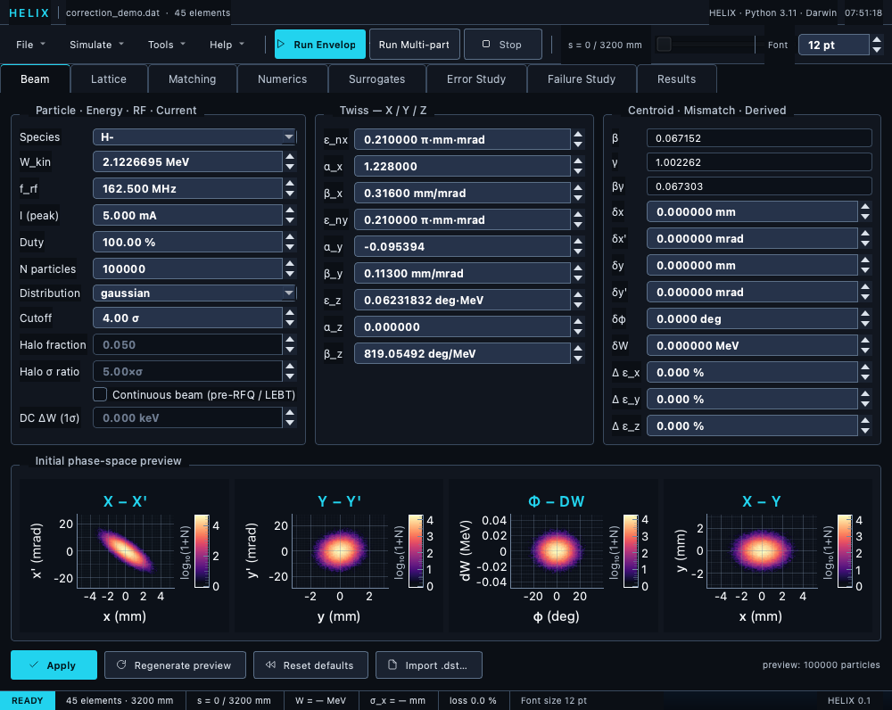

# GUI overview

HELIX ships with a complete PyQt6 graphical workbench for interactive
lattice editing, simulation control, and result inspection.  Run it
with:

```bash
./run_gui.sh                            # Linux / WSL / macOS
run_gui.bat                             # Windows
./HELIX.command                         # macOS — double-clickable
python -m linac_gen_gui.interphase.app  # direct module entry point
uv run python -m linac_gen_gui.interphase.app   # uv-managed
```

For detailed launcher behaviour, environment overrides
(`HELIX_PYTHON`, `QT_QPA_PLATFORM`, headless `offscreen` mode),
and cross-platform notes see
[Installation → Launching the GUI](../01_getting_started/02_installation.md#launching-the-gui).

Or use the bundled Windows `.exe`:

```
C:\Project\Linac_Gen_build\dist\HELIX\HELIX.exe
```



*The full window — File/Simulate/Tools/Help menus, Run/Stop toolbar, the eight-tab strip, and the live status bar.*

## Layout

The main window has a top toolbar (menus + run controls), a
horizontal tab bar underneath it, the content panel, and a status
bar at the bottom:

```
┌───────────────────────────────────────────────────────────────────────────┐
│ File  Simulate  Tools  Help │ [Run Envelope] [Run Multi-particle] [Stop]  │
│                             │ s = 0 / — mm [──slider──]        Font [pt]  │ ← Toolbar
├───────────────────────────────────────────────────────────────────────────┤
│ Beam│Lattice│Matching│Numerics│Surrogates│Error Study│Failure Study│Results│ ← Tab bar
├───────────────────────────────────────────────────────────────────────────┤
│                                                                           │
│                             Tab content                                   │
│                            (varies per tab)                               │
│                                                                           │
├───────────────────────────────────────────────────────────────────────────┤
│ READY │ 245 elements · 18957 mm │ s = 0 / 18957 mm │ σ_x │ loss │ ...     │ ← Status bar
└───────────────────────────────────────────────────────────────────────────┘
```

The toolbar carries four menus — **File**, **Simulate**, **Tools**,
**Help** — plus the **Run Envelope**, **Run Multi-particle**, and
**Stop** buttons, the s-cursor slider (which doubles as a run-progress
indicator), and a **Font** size spinbox.  The **Simulate** menu also
holds **Backtrack Distribution…** — reconstruct the upstream beam from
the last MP run's exit state or from a measured exit-plane `.dst` (see
the [workflow](08_workflows.md#i-want-to-reconstruct-the-input-beam-from-an-exit-distribution)).

## Tabs

Left to right:

| Tab | Purpose |
|---|---|
| **Beam** | configure species, energy, current, distribution, Twiss |
| **Lattice** | view/edit lattice elements, import `.dat` |
| **Matching** | SET/ADJUST cards interactive editor, run matcher |
| **Numerics** | space-charge grid, kernel, GPU/CPU, integrator settings + convergence scans |
| **Surrogates** | train / engage ML surrogates for field-map elements |
| **Error Study** | tolerance studies — element + beam errors, run ensembles |
| **Failure Study** | element-failure sweeps (off/detune/partial) + compensation |
| **Results** | post-tracking diagnostics — emittance, halo, loss, IBS, magstrip |

Each tab gets its own chapter:

* [Beam tab](03_beam_tab.md)
* [Lattice tab](02_lattice_tab.md)
* [Matching tab](05_matching_tab.md)
* [Numerics tab](04_convergence_tab.md)
* [Surrogates tab](06b_surrogates_tab.md)
* [Error Study tab](06_errors_tab.md)
* [Failure Study tab](06c_failures_tab.md)
* [Results tab](07_results_tab.md)
* [Workflows](08_workflows.md) — "I want to do X, where do I click"

## Common operations

| Goal | Where |
|---|---|
| Open a `.dat` lattice | File → Open Lattice… (Ctrl+O) or Lattice tab → **Open…** |
| Open a project (`.lgproj`) | File → Open Project… (no shortcut) |
| Save the lattice `.dat` | File → Save Lattice (Ctrl+S) |
| Save the project | File → Save Project… (no shortcut) |
| Run tracking | toolbar **Run Envelope** (Ctrl+R) or **Run Multi-particle** (Ctrl+Shift+R) |
| Cancel a long run | toolbar **Stop** |
| Inspect an element | click it in the Lattice tab list |
| Add element error | Error Study tab → Element errors form |
| Plot results | Results tab → click any tile |

## Status bar

The bottom strip shows transient, auto-clearing messages (save /
export confirmations, element edits) so every action gets visible
feedback.  It also carries a **● unsaved** pill that lights when the
lattice has uncommitted edits, a state pill that flips between
**READY / RUNNING / DONE**, and permanent segments for the loaded
lattice (element count + total length), the s-cursor position, the
reference energy, the end-of-run σ_x, and the loss percentage.

## Settings persistence

The GUI uses `QSettings` (organisation `Linac_Gen`, application
`Interphase`) to remember:

* Last opened project / lattice path (and last-used directory).
* Window geometry.
* Recently used projects.
* Font size.
* Calculation directory (where auto-saved HDF5 dumps land).
* Numerics-tab section collapse states.

These persist across sessions in `~/.config/Linac_Gen/` (Linux/WSL),
macOS CFPreferences, or the Windows registry.  Space-charge / solver
settings are **not** stored in QSettings — they are serialised into
the `.lgproj` project file instead.

## Cross-references

* [Quick start → Path D (GUI)](../01_getting_started/03_quick_start.md)
* [Workflows](08_workflows.md)

← [Phase advance](../09_diagnostics/06_phase_advance.md) ·
[Continue to Lattice tab →](02_lattice_tab.md)
