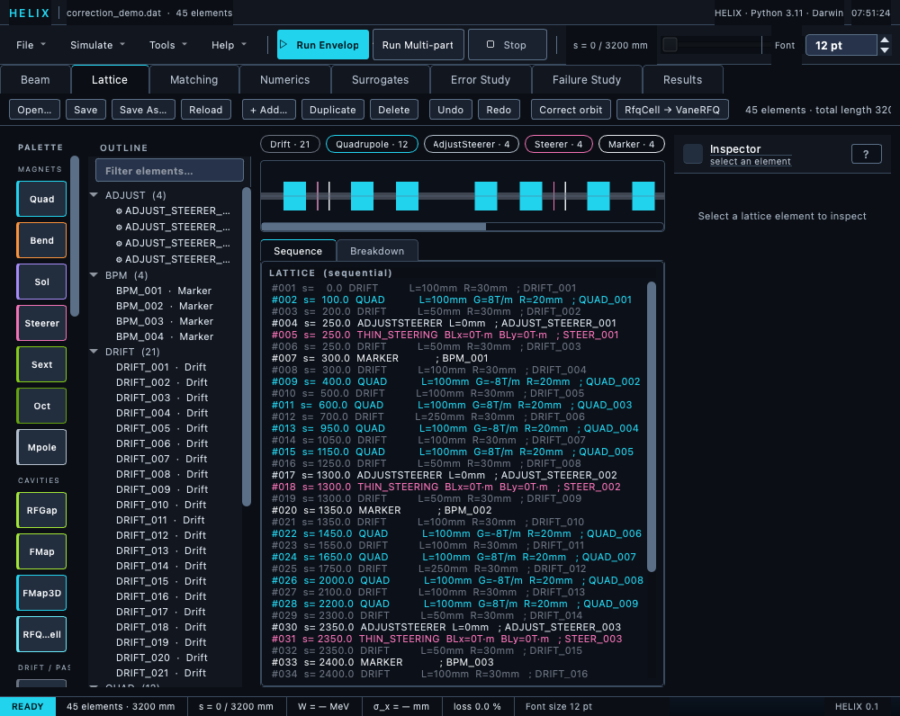

# Lattice tab

The Lattice tab shows the loaded lattice as a graphical timeline plus
a sequential listing and provides per-element editing.  This is where
you spend time when building or auditing a lattice.



*Lattice tab with the correction-demo lattice: palette, outline tree, type chips, timeline, sequence listing, and the inspector.*

## Layout

```
┌────────────────────────────────────────────────────────────────────┐
│ [Open…] [Save] [Save As…] [Reload]  [+ Add…] [Duplicate] [Delete]  │
│ [Undo] [Redo]  [Correct orbit] [RfqCell → VaneRFQ]   summary text  │
├─────────┬─────────────┬───────────────────────────────┬────────────┤
│ Palette │ Outline     │ [type chips: Drift Quad Cav …]│ Inspector  │
│         │ tree        │ ───────────────────────────── │            │
│  Drift  │             │        Element timeline       │ Name: QF1  │
│  Quad   │  D0  Drift  │  ▓▓░░▓▓░░▓▓░░▓▓░░▓▓░░▓▓░░▓▓   │ Length: …  │
│  Cavity │  QF1 Quad   │ ───────────────────────────── │ Gradient:… │
│  Sole.  │  D1  Drift  │ ┌ Sequence ┬ Breakdown ┐      │ Aperture:… │
│  ...    │  QD1 Quad   │ │ card listing / per-   │     │ dx: … dy:… │
│         │  ...        │ │ type summary          │     │ ...        │
└─────────┴─────────────┴───────────────────────────────┴────────────┘
```

The toolbar strip (top) holds the file operations — **Open…**,
**Save**, **Save As…**, **Reload** — followed by the edit buttons
**+ Add…**, **Duplicate**, **Delete**, **Undo**, **Redo**, then
**Correct orbit** and **RfqCell → VaneRFQ**.  The body is four
columns: an element **palette** (drag or double-click to insert), the
**outline tree**, the centre pane (type-chip filter strip + element
timeline + a **Sequence** / **Breakdown** tabbed view), and the
element **inspector** on the right.

## Loading a lattice

Three paths:

* **Lattice tab → Open…** button.
* **File menu → Open Lattice…**.
* **Ctrl+O**.

The dialog accepts TraceWin `.dat` files and MAD-X `.madx` / `.seq`
files; the file extension selects the parser (`parse_tracewin` or
`parse_madx` — see
[Importing MAD-X lattices](../06_running/02_tracewin_dat.md#importing-mad-x-lattices)).
Errors and warnings appear in the status bar.

**Reload** re-parses the current file from disk, discarding in-memory
edits (after the unsaved-changes prompt) — handy when you edit the
`.dat` in an external editor.

## Editing elements

Click any element in the timeline, the outline tree, or the Sequence
listing.  The inspector on the right shows all fields:

* Required parameters (length, gradient, etc.) at the top.
* Misalignment fields (dx, dy, dz, tilt_deg, ...) below.
* Field-error fields (gradient_rel, voltage_rel, ...) if applicable.

Edit any field; the change is applied immediately to the in-memory
`Lattice` (and reflected in any subsequent simulation run).

### ? help button (per-element manual)

The header row next to the element name contains a `?` button (also
bound to F1).  Clicking it opens the manual chapter for that element's
type in an inline popup rendered directly from the markdown source —
no browser, no broken styling.  The popup stays open while you keep
editing parameters in the inspector so you can refer to the chapter
in parallel.

## Right-click context menu

Right-click an element in the timeline or the outline tree for the
edit menu: **Insert before**, **Insert after**, **Duplicate**,
**Delete**, and **Cut / Copy / Paste** (an in-process clipboard;
Paste inserts a deep copy after the selection).

## Tools → Parameter Scan…

Element-parameter scans live in the **Tools → Parameter Scan…**
dialog — a non-modal popup with its own **Element** dropdown, so it
stays open while you keep working in the tabs.  Pick:

* **Element** — any element in the loaded lattice.
* **Parameter** — any scalar attribute on the element (length,
  gradient, kb, ke, phase, …).
* **From / to / N points** — the scan range.
* **Mode** — **Envelope** (fast) or **Multi-particle** (slow but
  accurate) radio buttons.
* **Output** — what to plot on the y-axis.  Choices include all
  RMS sizes (σ_x / σ_y / σ_φ / σ_W), every normalised emittance
  (ε_nx, ε_ny, ε_nz, ε_4D), the Balandin eigen-emittances ε_e1, ε_e2,
  transmission, exit kinetic energy, and exit Twiss α / β.  Growth
  ratios (ε_out / ε_in) are available for the four emittance metrics.
  Halo_x / Halo_y are MP-only — they stay empty in Envelope mode
  (envelope doesn't model halo).

The scanned parameter is **restored to its nominal value** on
completion, abort, or exception, so the lattice is never left
modified by the scan.  The inspector refreshes when the worker
finishes so the spinbox shows the restored value.

## Adding / removing / reordering

* **Add**: the **+ Add…** toolbar button (Ins / Ctrl+N), the
  context-menu **Insert before/after** entries, or the **palette** —
  drag a type onto the timeline at the position you want, or
  double-click a palette entry to insert after the selection.
  FieldMap / FieldMap3D palette inserts open a file picker for the
  field data first.
* **Duplicate**: **Duplicate** button or Ctrl+D — inserts a clone
  right after the original.
* **Remove**: **Delete** button or Del.  A Shift+Click multi-select
  on the timeline deletes all selected elements as one undoable step.
* **Cut / Copy / Paste**: Ctrl+X / Ctrl+C / Ctrl+V (also on the
  context menu).
* **Reorder**: drag-and-drop rows in the **outline tree**.
* **Undo / Redo**: **Undo** / **Redo** buttons or Ctrl+Z /
  Ctrl+Y (Ctrl+Shift+Z also redoes) — every insert, delete, move,
  and parameter edit goes through the command bus, so the full
  editing history is walkable.

The **type-chip strip** above the timeline filters by element type —
click a chip to dim everything else, which makes quad or cavity
patterns easy to eyeball on a long lattice.  The **Breakdown** tab
under the timeline shows a per-type count/length summary next to the
default **Sequence** card listing.

## Correct orbit

The **Correct orbit** toolbar button runs a one-shot orbit-correction
pass on the current lattice using its `ADJUST_STEERER` +
`DIAG_POSITION` cards (or `BPM_*` / `STEER_*` name patterns when no
cards are present).  BPMs carrying `DIAG_POSITION N X Y` targets are
steered **onto those targets** (TraceWin "matched with diagnostics");
target-less BPMs are flattened to zero as before.  BPM readings come
from multi-particle tracking of the configured beam.  Steerer kicks
are applied through the command bus, so the pass is undoable.  See
[Running → GUI → Path D](../06_running/05_gui.md#path-d-standalone-orbit-correction)
and [Errors → Orbit correction](../08_errors/07_correction.md).

## BPM targets…

The **BPM targets…** button loads an external set-point file onto the
loaded lattice — one `x_mm y_mm [weight]` row per `is_bpm` marker, in
lattice order (`nan` leaves a plane free; row count must match the BPM
count exactly).  Use it to reproduce a *measured machine orbit*: the
loaded targets override any `DIAG_POSITION` operands for both the
Correct-orbit pass and the Matching tab's auto-generated position
constraints, but they are runtime-only — saving the lattice never
writes them into the `.dat`.  Position constraints evaluate only with
the Matching tab's **mp** cost solver (the envelope carries no
centroid).

## RfqCell → VaneRFQ

The **RfqCell → VaneRFQ** toolbar button picks a `.vane` file and
replaces the lattice's RfqCell chain with a single VaneRFQ element
(the Toutatis-equivalent path).  After the swap, use the inspector's
`field_model` dropdown to choose `2term` / `8term` / `laplace2d`.

## Saving

* **Save** (File → Save Lattice, Ctrl+S) writes the lattice back to
  its `.dat` file **in place**.  If the lattice was imported from a
  MAD-X `.madx` / `.seq` file — or has no path yet — HELIX only
  writes TraceWin `.dat`, so Save automatically reroutes to
  **Save As…** with a `*.dat` filter.  Your MAD-X source file is
  never overwritten.
* **Save As…** (File → Save Lattice As…) writes a `.dat` file with
  all the current values, fully TraceWin-compatible.
* **File → Save Project…** writes the full `.lgproj` including beam
  config and SC config.

### Unsaved-changes prompts

Two dirty flags are tracked independently:

* **Lattice dirty** — element insert / delete / move, inspector
  parameter edits, applying a matched lattice.  Lit by the
  CommandBus's undo/redo machinery; cleared on Save Lattice.
* **Project dirty** — Beam tab Apply, Numerics tab settings
  edits, applying a matched lattice (also flags project dirty since
  beam config changed).  Cleared on Save Project / Load Project.

Closing the window or opening another lattice/project triggers a
prompt that names the dirty file(s) and offers **Save / Discard /
Cancel**.  Save runs both writers (lattice + project) if both are
dirty; the action proceeds only if both succeed.  Applying a matched
lattice flags **both** dirty — the matched .dat differs from the
on-disk file and the matched beam config differs from the .lgproj —
so quitting after Apply without an explicit Save triggers the prompt.

The prompt's **Show Details…** button itemizes exactly what is at
risk before you choose:

* **Lattice edits since the last save** — one line per edit from the
  undo history (`QUAD 'Q7': gradient 10.6 → 9.48`, `deleted Drift
  'D3'`, …).  Wholesale replacements that no single edit describes
  (e.g. an applied match result) and edits **undone past the save
  point** are reported as such rather than silently omitted.
* **Project settings vs the saved .lgproj** — a field-by-field diff
  of the live configuration against the file on disk
  (`beam.current: 5 → 4.8`, `convergence.grid_nx: 48 → 64`).  If the
  project was never saved, the details say so instead of listing
  every field.

## Cross-references

* [Element catalog](../03_elements/00_overview.md)
* [.dat file reference](../06_running/02_tracewin_dat.md)
* [Errors → Element errors](../08_errors/03_element_errors.md)

← [Overview](01_overview.md) ·
[Continue to Beam tab →](03_beam_tab.md)
