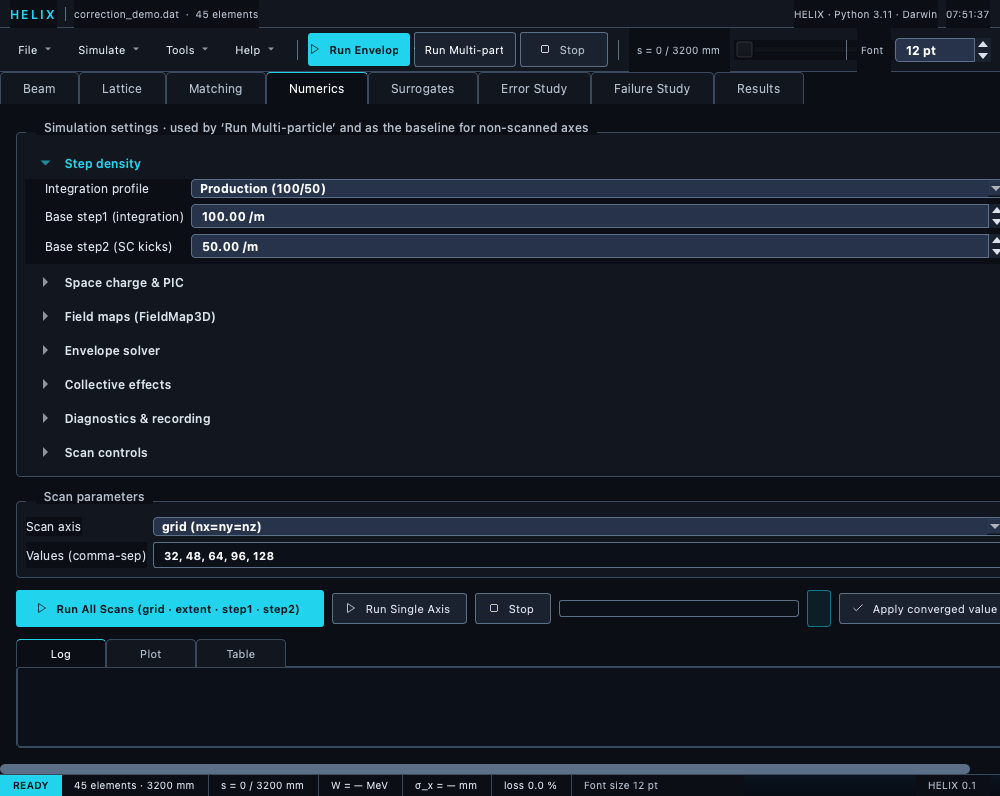

# Numerics tab

Configure tracking-step density and space-charge solver settings.
Wraps `SpaceChargeConfig` and tracker-level integrator parameters
in a single panel.

*Numerics tab — collapsible numerics sections plus the built-in convergence-scan controls.*

## Sections

The settings panel is grouped into seven **collapsible sections**;
only "Step density" opens by default, and each section's open/closed
state is persisted per user across sessions:

* **Step density** — an **Integration profile** preset combo
  (`Production (100/50)` / `Matching (30/15)` / `Custom` — editing
  either spinbox by hand switches to Custom), plus base step1
  (integration steps per metre) and step2 (SC kicks per metre).
  Map to TraceWin's `PARTRAN_STEP step1 step2`.
* **Space charge & PIC** — **Base PIC grid (nx=ny=nz)**: a single
  cubic spinbox (one value sets all three axes); grid extent
  (σ multiplier); **PIC backend** (auto / cpu / gpu / cuda / mps);
  **SC engine** — `numpy` (production PIC, default) or `torch`
  (the differentiable PyTorch PIC). Pick `torch` for the
  autograd-differentiable space-charge kick; it runs FP64 on CPU,
  handles bunched beams only, and is markedly slower. Selecting it
  greys out Grid mode, PIC backend and DC kernel (torch ignores
  them — it always uses an adaptive grid); a continuous beam falls
  back to `numpy` automatically.  Also: Green's function (IGF /
  point), particle-mesh kernel (CIC / TSC), grid mode
  (fixed / adaptive), and the DC SC kernel (uniform / gaussian /
  pic2d) for continuous beams.
* **Field maps (FieldMap3D)** — integrator (KD / DKD) and
  interpolation order (linear / cubic).
* **Envelope solver** — solver choice: `matrix`
  (element-by-element transfer-matrix Σ propagation, default) or
  `sacherer` (coupled KV envelope ODE integrated with RK45; better
  under strong SC where the matrix split-operator under-resolves).
* **Collective effects** — "CSR in bends" checkbox: apply a 1-D
  steady-state Coherent Synchrotron Radiation energy kick inside
  dipoles (multi-particle runs only — see
  [Space-charge models → CSR](../05_space_charge/01_models.md)).
* **Diagnostics & recording** — `record_substeps` checkbox;
  **Record particle density** (histogram all alive particles into a
  2-D density grid along s); **Snapshot every N** (full 6-D particle
  dump every N elements; 0 = only `Marker(snapshot=True)` fires);
  density bins and density extent (±mm) for the density recording.
* **Scan controls** — **Scan N particles** (macroparticle count the
  convergence scans use) and **Parallel workers** (0 = serial; N > 1
  fans scan points across processes).

## Convergence scans

Convergence scans are **built into this tab** — no separate dialog.
The **Scan parameters** group has:

* **Scan axis** combo — `grid (nx=ny=nz)`, `grid_extent (σ)`,
  `step1 (integration/m)`, `step2 (SC kicks/m)`, or `n_particles`.
* **Values (comma-sep)** field — the scan points; defaults to
  `32, 48, 64, 96, 128`.

The run row below offers:

* **Run All Scans (grid · extent · step1 · step2)** — scans all four
  PIC/step parameters in sequence and auto-applies the converged
  value for each axis as it finishes.
* **Run Single Axis** — scan just the selected axis with the Values
  list.
* **Stop** — halt at the next element boundary, keeping the rows
  already completed.
* **Apply converged value** — write the converged row's scan value
  back into the base settings used by Run Multi-particle.

Results stream into a tabbed output pane: **Log** (per-axis
convergence log), **Plot** (ε_x end + σ_y vs scan value), and
**Table** (per-point σ_x / σ_y / σ_φ / ε_x / ε_y / wall time).

## Tooltips with formula references

Each field has a tooltip explaining its meaning + the relevant
physics paper.  E.g. the IGF tooltip cites Qiang et al. 2006.

## Project dirty tracking

Every "fixed" setting in this tab (PIC grid, SC engine, Green's
function, particle-mesh kernel, integrator, interp, step1 / step2,
CSR flag) is serialised into the `.lgproj` JSON.  Changing any of
them marks the project as dirty so closing without Save Project
triggers a warning.  Section-collapse toggles and scan-axis widgets
don't flag the project — collapse states persist per user via
QSettings instead, and the scan-axis widgets are session-only.  See
[Lattice tab → Unsaved-changes prompts](02_lattice_tab.md#unsaved-changes-prompts).

## Cross-references

* [PIC solver](../05_space_charge/02_pic_solver.md)
* [Kernels](../05_space_charge/03_kernels.md)
* [DC mode](../05_space_charge/04_dc_mode.md)
* [Convergence guide](../05_space_charge/05_convergence.md)

← [Beam tab](03_beam_tab.md) ·
[Continue to Matching tab →](05_matching_tab.md)
