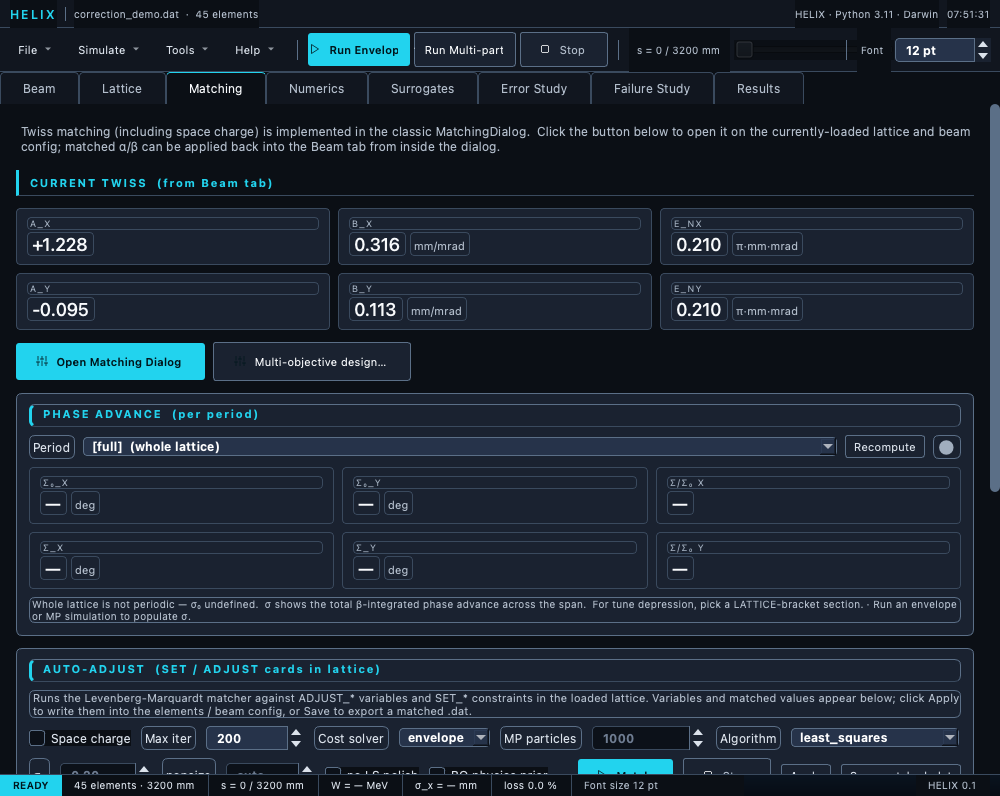

# Matching tab

The Matching tab gathers three matching tools for the loaded lattice
and beam: a Twiss dialog, a phase-advance analyser, and the
card-driven **auto-adjust matcher**.



*Matching tab — periods/KPIs, the σ₀ phase-advance panel, and the auto-adjust matcher controls.*

## Current Twiss

KPI cards at the top echo the input Twiss (α, β, ε) from the
[Beam tab](03_beam_tab.md) — the starting point every tool uses.

## Open Matching Dialog

Opens the classic **Matching Dialog**: it computes the periodic Twiss
of a lattice (or section) and the space-charge-matched Twiss, and can
write the result back into the Beam tab.  Use it to find a matched
input beam for a periodic structure.

### Mode: Whole lattice vs FODO cell

The dialog's **Mode** dropdown offers two entries — **"Whole lattice
(periodic ring)"** and **"FODO cell → entrance (transfer line)"** —
switching between two distinct physical questions:

| Mode | Physical question | Math |
|---|---|---|
| **Whole lattice** (`find_periodic_twiss`) | "What input Twiss, tracked once through the *entire* lattice, comes back to itself at the end?" | One-turn 6×6 transfer matrix M of the whole lattice → extract matched Twiss. |
| **FODO cell** (`find_matched_input_twiss`) | "There's a repeating sub-section.  What Twiss do I inject at s=0 so the beam is matched to that sub-section's period by the time it arrives?" | Periodic Twiss of just the picked sub-cell, then back-propagated through the inverse of the front section to s=0. |

#### When to use which

**Whole lattice mode** is for genuinely periodic structures:

| Lattice type | Whole-lattice? | Why |
|---|---|---|
| Storage rings, synchrotrons, FFAGs | ✓ Yes | The beam circulates; "one turn = lattice" is literally periodic. |
| Booster, main injector, collider arcs treated as rings | ✓ Yes | Same reason. |
| A single FODO cell modeled in isolation, asking "what's the matched solution if this repeats forever?" | ✓ Yes | Mathematically identical to a ring of one cell. |
| HWR / SSR / cryomodule cavities | ✗ No | Accelerating: eigenvalues drift off the unit circle as βγ grows.  Mathematically diverges. |
| MEBT, BTL, HEBT, dump lines | ✗ No | Transfer lines — one-pass, not periodic.  Use cell mode. |
| LEBT, RFQ | ✗ No | Acceleration + non-periodic geometry breaks the assumption. |

**FODO cell mode** is for everything else PIP-II-class: a transfer
line or linac with a repeating sub-section inside it.  Cell mode
finds the matched *injection* Twiss — the entrance Twiss that lands
the beam in periodic equilibrium by the time it reaches your chosen
sub-cell.

#### Practical rule of thumb for PIP-II work

For **every** lattice in `examples/pipii/*` — HWR, SSR1, SSR2, LB650,
HB650, MEBT, BTL — **use FODO cell mode**.  Whole-lattice mode is
there for ring lattices HELIX doesn't currently target.

If the cell mode auto-detection picks the wrong sub-cell or finds
none (rare), use the **--cell-start N --cell-end M** flags on the CLI
(or pick a different cell index in the GUI cell combo).

#### Cells with bends (BTL, dispersive arcs)

BTL and HEBT arcs include dipoles → there's **dispersion** in the
matched beam.  The zero-current `find_matched_input_twiss` only
matches transverse betatron (α, β); it **ignores dispersion**.  For
arcs, use **Compute SC-Matched Twiss** even at zero or low current — it
calls `find_sc_matched_input_twiss` which uses an 8-state formulation
(α, β per plane + D, D' per plane) that matches dispersion together
with the betatron Twiss.

#### Accelerating-section warning

When the chosen cell or whole lattice accelerates significantly (HWR
cryomodule: βγ grows ~1.04× per period), the eigenvector / Wolski
method emits a stderr line:

```
[matched-Σ] accelerating-section deviation 0.041 from unit circle
            (moduli=[0.9588, 0.9588, 0.9636, 0.9636]); matched Σ is
            the smooth approximation.
```

This is **physics, not a numerical error** — the matched Σ is the
closest-to-periodic solution given the acceleration.  Tolerance is
±15% off the unit circle; truly unstable lattices (>15% deviation)
still raise.

### Decoupled vs coupled lattices

The dialog auto-detects whether the transverse one-turn map is
**decoupled** (block-diagonal x and y — typical for quadrupole-only
FODO cells) or **coupled** (non-zero x↔y off-diagonals — solenoid
sections, HWR-style cryomodules, skew quads).

* **Decoupled**: extracts standard Courant–Snyder α / β per plane
  from the 2×2 diagonal blocks.  Fast and exact.
* **Coupled**: falls back to the eigenvector / Wolski method on the
  full 4×4 transverse map.  Builds the matched 4×4 Σ from the two
  normal-mode eigenvectors and reports per-plane α / β as
  **projections** of that Σ (what x-only and y-only diagnostics
  measure), plus the two normal-mode phase advances μ₁ and μ₂.

When the coupled fallback fires, the log line is suffixed with
`[COUPLED -- normal-mode advances μ₁=…°, μ₂=…°; α/β are Σ projections]`
so you know the per-plane Twiss is the projection, not decoupled
Courant–Snyder.  This is the load-bearing fix for HWR cryomodule
matching where the previous Twiss calculation refused to return
(by design — the 2×2 trace is not the one-turn phase advance under
coupling).

## Multi-objective design…

The **Multi-objective design…** button opens a dialog that explores the
Pareto trade-off between *competing* objectives (e.g. emittance growth vs
exit energy) over the lattice's ADJUST knobs — distinct from the matcher,
which drives a single scalar cost to zero. Tick ≥2 objectives, choose the
algorithm (`nsga2` genetic / `qnehvi` Bayesian) and cost solver, **Run**,
then read the Pareto front off the scatter + table and **Apply knee
point** to commit a balanced design. See
[Multi-objective design](../07_matching/08_multiobjective.md).

## Phase Advance panel

Pick a period (LATTICE-card brackets are detected automatically, with
a whole-lattice fallback) and the panel reports the **channel tunes**
from the envelope phase probe: σ₀_model (bare) and σ_model (depressed,
primary) with **η_model = σ_model/σ₀_model** as the tune-depression KPI,
plus the beam Δμ_rms (secondary, with a tooltip caveat) from the latest
envelope run.  Coupled cells report the normal-mode tunes I/II; a
"frozen-longitudinal" tag appears where the longitudinal fixed point is
not solved.  Validity notes surface when the beam is not matched (BMAG),
when β is projected-only inside a coupled interior, or when sampling is
coarse.  See [Phase advance & tune
depression](../09_diagnostics/06_phase_advance.md) for the full
definitions.

## Auto-Adjust panel

Runs the lattice-driven matcher against the `ADJUST_*` variables and
`SET_*` constraints **already present in the loaded lattice** — the
variables and constraints are *not* entered in the GUI; they come from
the `.dat` cards (see [SET / ADJUST](../07_matching/02_set_adjust.md)).

Controls (options row):

| Control | Effect |
|---|---|
| **Space charge** | include space charge in the forward pass.  Envelope cost-solver uses its linear-SC model; MP cost-solver uses the configured `SpaceChargeConfig` (Numerics tab). |
| **Max iter** | iteration cap (function evals for `least_squares`; generations for population algorithms) |
| **Algorithm** | optimiser — `least_squares`, `differential_evolution`, `dual_annealing`, `cmaes`, `sequential_scan`, `gradient`, or `bayesopt` |
| **CMA-ES σ / popsize** | initial step (fraction of bound width) and population size; enabled when algorithm is `cmaes` |
| **no LS polish** | skip the final `least_squares` refinement after the global search.  Enabled for `cmaes` **and** `bayesopt`; greyed out otherwise. |
| **BO physics prior** | `bayesopt` only: warm-start an expensive MP match from the cheap envelope cost.  Enabled when algorithm is `bayesopt` (effective with Cost solver = mp). |
| **Cost solver** | which forward pass computes the cost — `envelope` (fast linear, default) or `mp` (full PIC, physics-accurate, ~50–100× slower per eval). |
| **MP particles** | macroparticles per MP cost evaluation.  Always visible, but enabled only when Cost solver = `mp` (greyed out otherwise).  There is no seed spinbox. |
| **Match** | run the matcher in the background |
| **Stop** | cancel a running match.  Lattice is restored to the best-cost x seen so far; the Variables table populates from that result. |
| **Apply** | write the matched values into the lattice + beam config; flags both as dirty so the close-without-save prompt warns you. |
| **Save matched .dat** | export the matched lattice to a TraceWin `.dat` |

`least_squares` is local and fast.  `differential_evolution` and
`dual_annealing` are global searches — slower, and they require finite
min/max bounds on every ADJUST card; if a bound is open-ended the run
stops with an error naming the variable.

`cmaes` is the recommended general-purpose pick for ~5–30 variable
matching problems.  It learns the covariance matrix of "improving
directions" and walks diagonally, which is much faster than coordinate
descent on correlated knobs (cavity ke + phase pairs, quadrupole
triplets).  With `refine` enabled (default), CMA-ES chains a final
`least_squares` polish from its best point.

`sequential_scan` is physics-aware coordinate descent — it walks
elements in lattice order and brackets each ADJUST'd parameter (with
FieldMap `kb`/`ke`/`phase` grouped).  Clicking **Match** with this
algorithm opens a setup dialog. Its controls:

| Setup control | Effect |
|---|---|
| **Element checklist** | tick which ADJUST'd elements to scan (default: all) |
| **Passes through lattice** | full sweeps over the element list |
| **Steps per parameter** | bracket steps each parameter is walked per pass |
| **Step size (fraction of bound width)** | per-step displacement = this × (vmax − vmin) |
| **Direction reversal** | `both grew` (flip only when *both* transverse and longitudinal ε exceed the reference) or `any grew` (stricter) |
| **Reversal reference ε:** | the ε the reversal compares against — *input beam* ε (tight) vs *seed exit* ε (the unmatched lattice's exit ε; natural for intrinsic-growth ε-minimisation) |
| **Beam loss** (`Reject any step that causes beam loss (HARD rule)`) | when ticked, any trial step whose transmission falls below the threshold is **rolled back** — `best_x` is *not* moved to it even if cost dropped — and the direction flips. Closes the gap where the matcher could "win" on ε by clipping halo. **Requires Cost solver = mp** (envelope mode tracks no losses; the control is inert there). |
| **Loss-rejection threshold** | transmission floor for that check — `100.00 %` rejects any loss; `99.90 %` tolerates sub-permille; enabled only when *Beam loss* is ticked |

See the [Sequential-scan section](../07_matching/07_emittance_min.md#sequential-scan)
for the physics and when to use each combination.

`bayesopt` is Gaussian-process **Bayesian optimisation** (BoTorch) —
the most **sample-efficient** global optimiser, reaching the optimum in
the fewest forward passes.  It is the right pick for **expensive**
matches (set **Cost solver = mp** / tick **Space charge**) and
multimodal / one-sided-constraint landscapes.  Tick **BO physics prior**
to warm-start an MP match from the cheap envelope cost.  Like `cmaes` it
chains a `least_squares` polish (untick **no LS polish** to keep it).
It is *not* the default — for cheap linear-envelope matches
`least_squares` / `gradient` reach the same optimum faster in wall-clock.
See [`examples/ml_bayesopt/`](../07_matching/05_recipes.md) for a runnable
A/B convergence demo.

#### Step-by-step: a Bayesian-optimisation match

1. Load a lattice with `ADJUST_*` + `SET_*`/`MIN_*` cards and set the
   beam on the [Beam tab](03_beam_tab.md) → **Apply**.
2. In **Auto-Adjust**, set **Algorithm → `bayesopt`**. (This enables the
   **BO physics prior** checkbox, which only `bayesopt` unlocks, and the
   **no LS polish** checkbox, which is enabled for `cmaes` and `bayesopt`.)
3. Set **Max iter** = number of Bayesian iterations (≈ 20–40 is plenty;
   BO is sample-efficient).
4. For the **expensive** case — the one BO is *for* — set **Cost solver →
   `mp`** and tick **Space charge**, then tick **BO physics prior**. The
   prior only has an effect in this exact combination (`bayesopt` **and**
   Cost solver = `mp`); it warm-starts the slow MP match by first scouting
   the box with the cheap envelope cost. For a quick envelope match, leave
   Cost solver = `envelope` and the prior checkbox does nothing.
5. Leave **no LS polish** unticked to keep the final `least_squares`
   clean-up from the BO best (recommended).
6. Click **Match**. The live convergence dialog plots cost + εnx/εny/εnz
   per evaluation; **Stop** keeps the best point so far.
7. Review the **Variables** / **Constraints** tables, then **Apply** to
   write the matched values into the lattice + beam (flags the project
   dirty), or **Save matched .dat** to export.

`gradient` is a local search that replaces the finite-difference
Jacobian with an *exact* one from differentiable tracking.  It covers
SET_TWISS / SET_SIZE matching of quad / solenoid / dipole knobs — and,
with **Space charge** ticked, matches *through* the non-linear PIC
space charge (a macro-particle bunch tracked by the differentiable PIC
step tracker).  It needs an all-linear lattice — drift / quad /
solenoid / dipole, no RF or field maps; outside that it stops with a
clear message telling you to switch back to `least_squares`.  For
matching sections with several knobs the exact Jacobian also runs
faster than the finite-difference one.

### Live convergence dialog

While the match runs, a non-modal **Match Convergence** dialog stays
on top showing:

* **Cost trace** — current cost + monotone-decreasing best-so-far on a
  log-Y axis vs evaluation index.
* **Emittance trace** — εnx, εny, εnz vs evaluation index on a linear-Y
  axis so you can watch the actual physics metric, not just the
  optimiser's cost.
* **Live values panel** — current εnx/εny/εnz, W_kin at exit, and
  (for sequential_scan only) the element + ADJUST attr being scanned,
  pass/step counters, scan direction.

Closing the dialog does **not** stop the match; that's the Stop
button's job.

Beyond the convergence dialog, any **Results-tab popup** with its
*live match preview* checkbox ticked (e.g. the Centroid popup with the
diagnostic goal-orbit overlay) re-plots the matcher's current iterate
about once per second during the run — see
[Results tab](07_results_tab.md).

### After a run

Two read-only tables fill in:

* **Variables** — name, initial value, matched value, bounds.
* **Constraints** — name, RMS residual, notes. Every `SET_*` / `MIN_*`
  card in the lattice gets a row here, including the soft-penalty cards
  **`MIN_EMIT_GROWTH`**, **`MIN_EMIT_4D_GROWTH`** and
  **`MIN_TRANSMISSION`** — e.g. a `MIN_TRANSMISSION 99.9 50.0` card shows
  up as a `MIN_TRANSMISSION` row whose residual is non-zero only when the
  beam drops below 99.9 % transmission (and is meaningful only with
  **Cost solver = mp**, since envelope mode tracks no losses). Read its
  residual to confirm the match didn't buy a low emittance by clipping
  the beam. See [SET / ADJUST cards](../07_matching/02_set_adjust.md).

…and the status line shows `OK / FAILED / Cancelled — best of run`
followed by `— N iters, cost baseline_cost → final_cost, T s`.  The
baseline cost is the cost at the unmatched `x0`, so you can see at a
glance whether the match actually improved things.

## Workflow

1. Load a lattice that contains `ADJUST_*` / `SET_*` cards.
2. In Auto-Adjust, pick the algorithm and (optionally) Space charge.
3. Click **Match** and watch the status line.
4. Review the Variables / Constraints tables.
5. Click **Apply** to commit, or **Save matched .dat** to export.

The algorithm choice and Max-iter are session settings — they are not
saved in the `.lgproj` project file.

## Cross-references

* [Matching → Overview](../07_matching/01_overview.md)
* [SET / ADJUST cards](../07_matching/02_set_adjust.md)
* [Matching Python API](../07_matching/03_python_api.md)
* [Worked example: matching walkthrough](../11_examples/07_matching_walkthrough.md)

← [Numerics tab](04_convergence_tab.md) ·
[Continue to Surrogates tab →](06b_surrogates_tab.md)
