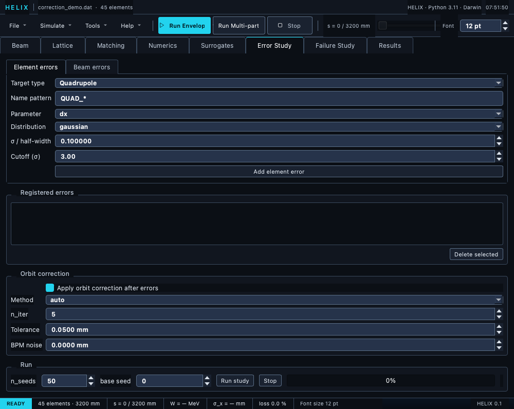

# Error Study tab

The Error Study tab is where you configure tolerance / Monte-Carlo error
studies and launch the ensemble.  Sits between Surrogates and
Failure Study in the tab strip.



*Error Study tab — element/beam error forms, registered-errors list, orbit-correction group, and the run controls.*

## Layout

```
┌──────────────────────────────────────────┐
│ [ Element errors ] [ Beam errors ]        │ ← Sub-tabs
├──────────────────────────────────────────┤
│ Add error form:                          │
│   Target type: [Quadrupole]              │
│   Name pattern: QUAD_*                   │
│   Parameter: [dx]                        │
│   Distribution: [gaussian]               │
│   σ / half-width: 0.2                    │
│   Cutoff (σ): 3.0                        │
│   [Add element error]                    │
├──────────────────────────────────────────┤
│ Registered errors:                        │
│   [ELEM] pattern=QUAD_* param=dx ...      │
│   [ELEM] pattern=QUAD_* param=dy ...      │
│   ...                                    │
│   [Delete selected]                      │
├──────────────────────────────────────────┤
│ Orbit correction:                        │
│   ☐ Apply orbit correction after errors  │
│   Method [auto]  n_iter [5]              │
│   Tolerance [0.05 mm]  BPM noise [0 mm]  │
├──────────────────────────────────────────┤
│ Run: n_seeds [50] base seed [0]          │
│      [Run study] [Stop] ▓▓▓▓▓            │
│ Status: seed 27/50 done                  │
└──────────────────────────────────────────┘
```

## Sub-tabs

* **Element errors** — alignment + field errors per element.
* **Beam errors** — input-beam jitter (centroid, ε, mismatch, current).

## Add an element error

1. Pick **Target type** — Quadrupole / Cavity (RFGap) / Bend (Dipole) / Solenoid.
2. **Name pattern** auto-fills (`QUAD_*`, `GAP_*`, ...).  Edit for
   specific elements.
3. Pick **Parameter** — fields refresh per target type.
4. Pick **Distribution** — gaussian or uniform.
5. Set **σ / half-width** in appropriate units (mm, deg, fractional).
6. Set **Cutoff** (gaussian only).
7. Click **Add element error**.

## Add a beam error

1. Switch to the **Beam errors** sub-tab.
2. Pick **Parameter** — centroid_x, current_rel, etc.
3. Set distribution + σ + cutoff.
4. Click **Add beam error**.

## Orbit correction

Tick **Apply orbit correction after errors** to run a correction pass
per seed between error injection and tracking, so the recorded
centroid is the *corrected* orbit.  The group's controls (enabled
only when the box is ticked):

* **Method** — `auto` (one-to-one when #steerers == #BPMs, else
  SVD), `one_to_one`, or `svd`.
* **n_iter** — correction iterations per seed (default 5).
* **Tolerance** — target RMS orbit in mm (default 0.05).
* **BPM noise** — 1σ measurement noise added to the BPM readings
  (mm; default 0).
* **Steer onto DIAG_POSITION targets** — correct each sample onto the
  deck's recorded `DIAG_POSITION` targets (or a loaded BPM-targets
  file) instead of flattening to zero — TraceWin's "matched with
  diagnostics" per error sample.  Target-less BPMs still steer to
  zero.
* **Readings** — `mp` (legacy: track a particle beam per reading) or
  `envelope (fast)`: deterministic envelope-centroid readings, no
  sampling noise, ~an order of magnitude faster per seed.

See [Errors → Orbit correction](../08_errors/07_correction.md).

## Run study

1. Set **n_seeds** (default 50; 100-200 for production).  The
   **base seed** spinbox offsets every per-seed RNG draw — leave at 0
   for the canonical run, or bump it (e.g. 1000) to extend an
   existing 50-seed study with statistically independent seeds
   [1000–1049].
2. Click **Run study**.  The status line confirms whether the study
   runs with **space charge ON or off** — it uses the exact
   `SpaceChargeConfig` from the Numerics tab whenever the beam
   current is non-zero, the same configuration a toolbar
   multi-particle run would use.
3. The progress bar advances per completed seed
   (`seed k/n done` on the status line).
4. On done: results land on `state.error_study_results` →
   open the Results tab to view ensemble plots.

### Stopping a study

**Stop** ends the study after the seed currently being tracked
(latency: one lattice element).  Seeds that completed are kept as a
**partial ensemble** — only whole seeds are aggregated, so the
statistics stay valid — and stored for the Results tab; the status
line reports `stopped — k/n seeds kept`.  If no seed finished,
nothing is stored.

## ERROR_* directives from the .dat

If your `.dat` has `ERROR_*` directives, **Run study** honours them
automatically — no form entry needed.  They do **not** appear in the
"Registered errors" list, which shows only form-added specs; the
directives live on the parsed lattice itself and are merged in at
run time.  If the list and the lattice are both empty, Run refuses
with a "no errors" warning.

## Cross-references

* [Errors → Overview](../08_errors/01_overview.md)
* [Errors → Running studies](../08_errors/05_running_studies.md)
* [Worked example: tolerance study](../11_examples/08_tolerance_study.md)

← [Surrogates tab](06b_surrogates_tab.md) ·
[Continue to Failure Study tab →](06c_failures_tab.md)
