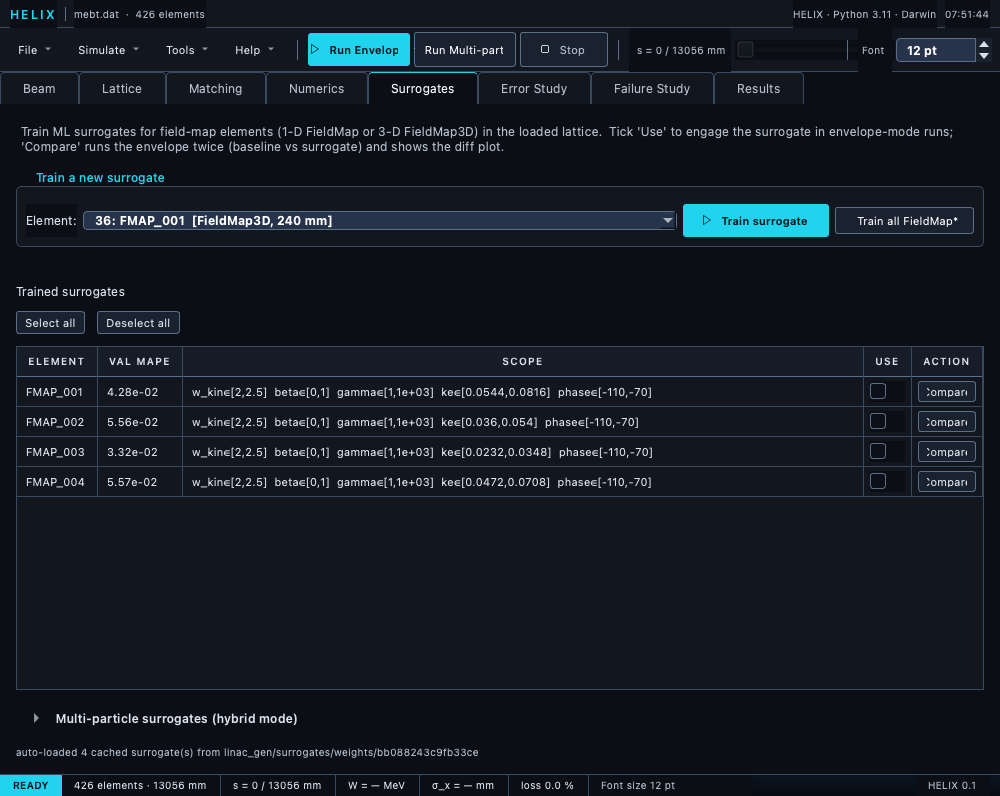

# Surrogates tab

The 5th tab in the strip (Beam · Lattice · Matching · Numerics ·
**Surrogates** · Error Study · Failure Study · Results).  Train,
register, and compare ML surrogate replacements for field-map
elements.

*Surrogates tab with the PIP-II MEBT loaded — element dropdown, trained-surrogates table, and the hybrid-MP section.*

## At a glance

* **Element dropdown** — every `FieldMap3D` and `FieldMap` (1-D /
  2-D cylindrical / quad-gradient) in the loaded lattice.  RFQ
  classes are excluded.
* **Train surrogate** button — modal dialog for samples / epochs /
  hidden dims / per-parameter sweep ranges / CPU workers.  Runs in
  a background `QThread`; GUI stays responsive.
* **Train all FieldMap\*** button — batch training: a selector
  dialog lists every FieldMap-class element (all ticked by default,
  with Select all / Select none buttons) plus shared
  samples / epochs / hidden-dims / workers settings, then trains
  the checked elements sequentially.
* **Trained-surrogates table** — auto-populates from cached weights
  for the current lattice on load.  Per row: element name, val
  MAPE, scope, **Use** checkbox (registers it), **Compare** button.
  **Select all** / **Deselect all** buttons above the table bulk-tick
  or untick every Use checkbox.
* **Cache-aware Train** — clicking Train for an element with
  existing cached weights opens an **Open / Retry / Cancel** modal:
  Open loads the cached weights, Retry retrains from scratch.
* **Multi-particle surrogates (hybrid mode)** — a collapsible
  section under the table that engages the *same* trained surrogates
  in multi-particle runs (linear-matrix anchor + cheap RK4
  residual).  Its **Engage in MP runs** master toggle drives
  `registry.set_mp_enabled`; **Residual RK4 substeps** (default 15)
  trades speed vs accuracy; **Compare MP** runs baseline-vs-hybrid
  MP simulations and reports speedup + σ diffs.

!!! note "Registry is cleared on lattice swap"
    Loading a different lattice clears the trained-surrogates table
    **and** the runtime registry — surrogates trained for the old
    lattice are never silently applied to the new one.  Re-tick
    **Use** after training/loading surrogates for the new lattice.

The dedicated [ML Surrogates section](../13_surrogates/01_overview.md)
has the full reference — what they are, when to use, the M3
limitation, training accuracy gates, and the equivalent CLI /
Python flows.

## Cross-references

* [ML Surrogates → GUI walkthrough](../13_surrogates/02_gui.md) —
  the step-by-step recipe with screenshots.
* [ML Surrogates → Overview](../13_surrogates/01_overview.md) —
  scope, accuracy, the M3 limitation.
* [ML Surrogates → Training guide](../13_surrogates/05_training_guide.md)
  — sample sizing, multiprocessing, OOD, persistence.

← [Matching tab](05_matching_tab.md) ·
[Continue to Error Study tab →](06_errors_tab.md)
