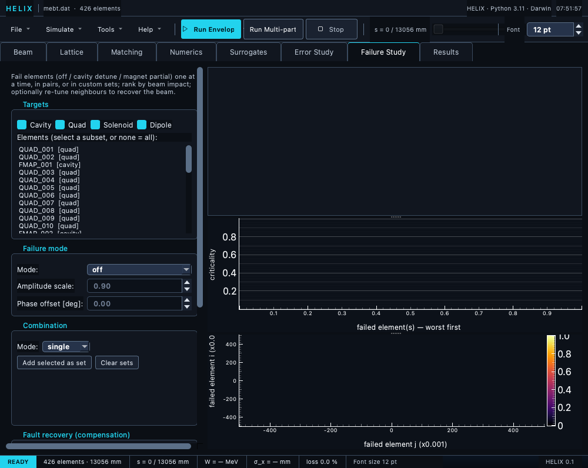

# Failure Study tab

The **Failure Study** tab runs **element failure analysis**: put active elements
(cavities, quads, solenoids, dipoles — never drifts) into a failure state,
sweep over single elements / all pairs / custom sets, rank scenarios by beam
impact, and — the MYRRHA / LightWin local-compensation scheme — re-tune
neighbouring elements to **recover** the beam after a failure.

```
┌ Targets ─────────────┐  ┌ Results ───────────────────────────┐
│ ☑Cavity ☑Quad ☑Sol   │  │ criticality ranking table           │
│ ☑Dipole              │  │ (scenario · criticality · T[%] ·    │
│ [ element list ]     │  │  εnx · εny · εnz · ΔE[MeV] ·        │
├ Failure mode ────────┤  │  loss[%] · recovered · *(rec)*)     │
│ Mode: off ▾          │  ├─────────────────────────────────────┤
│ Amplitude / Phase    │  │ criticality bar chart (top 15)      │
├ Combination ─────────┤  ├─────────────────────────────────────┤
│ single / pairs /     │  │ pair-failure heatmap (N×N)          │
│ custom (set builder) │  │                                     │
├ Fault recovery ──────┤  └─────────────────────────────────────┘
│ ☐ re-tune neighbours │
│ strategy · k/l · algo│
├ Run ─────────────────┤
│ envelope/mp (serial) │
│ [Run failure study]  │
│ [Stop] ▓▓▓▓▓▓▓▓▓     │
└──────────────────────┘
```



*Failure Study tab with the MEBT loaded — failure kind/combination controls on the left, results table and plots on the right.*

## Controls

### Targets
Tick the **element types** to consider; the **element list** then shows the
failable elements of those types (drifts and passive elements are excluded, as
are duplicate-named elements). Select a subset to restrict the sweep, or select
nothing to use all of the checked types.

### Failure mode

| Mode | Effect | Applies to |
|---|---|---|
| **off** | element transfers nothing (relative strength → −100 %) | all |
| **detune** | cavity **amplitude scale** (e.g. 0.9) and/or **phase offset** [deg] | cavities |
| **partial** | magnet **field/gradient scaled** to a fraction (e.g. 0.90) | magnets |

The amplitude / phase fields enable only for the modes that use them.

### Combination

* **single** — each selected element fails alone → a criticality ranking.
* **pairs** — every pair fails together → an N×N criticality **heatmap** with
  element-name ticks and a colour scale (the diagonal reuses the single-failure
  results). The heatmap **fills in live** as the sweep runs and the status shows
  `done/total`. Cost is **O(N²)** — N elements give N + N(N−1)/2 scenarios (16 →
  136), and the GUI runs them **serially**, so on a heavy lattice (e.g. HWR
  FieldMaps, ~16 s/scenario) a full pairs sweep takes tens of minutes. Practical
  recipe: run **single** first to rank elements, then **select the few worst in
  the element list** and run *pairs* on just that subset — or use the CLI with
  `--workers` for a parallel full sweep.
* **custom** — build explicit failure sets: select elements, **Add selected as
  set**; each set fails as a unit.  **Clear sets** empties the list to start
  over.

### Fault recovery (compensation)
Tick **Re-tune neighbours to recover the beam** to attempt compensation of the
worst scenarios after the sweep:

* **Strategy** — `k_out_of_n` (the *k* nearest same-category elements on each
  side), `l_neighboring_lattices` (full FODO periods around the fault), or
  `manual`.
* **k / l** — zone size.
* **Algorithm** — the matcher used to re-tune (`cmaes` recommended for the
  multimodal RF amplitude+phase landscape; `least_squares` for magnets).
* **Cost solver** — `envelope` (fast, recovers energy) or `mp` (sees beam
  loss; needed to recover transmission).
* **Compensate top-N** — how many of the worst scenarios to attempt.

The matcher injects temporary `ADJUST` cards on the compensators (cavity
voltage + phase, magnet gradient/field) and `SET_KE_OUT_MIN` (+ `MIN_TRANSMISSION`
in MP mode) objectives to restore the design exit energy without losing beam.

### Run
**Forward model** (`envelope`/`mp`). The GUI sweeps **serially in-process** on
the in-memory lattice so edited/unsaved element names are honoured exactly — the
**Workers** field is therefore disabled (CLI-only); for a parallel multi-core
sweep use `python -m linac_gen failures`. **Run failure study** starts a
background worker; **Stop** cancels.

## Reading the results

* **Ranking table** — scenarios in descending criticality. Columns:
  **T [%]** (exit transmission), **εnx / εny / εnz** (normalised RMS
  emittances; εnz follows HELIX's βγ·ε_z mm·mrad convention), **ΔE [MeV]**
  (exit-energy deviation), and **loss [%]** (= 100 − T; shows `—` in envelope
  mode, which models no aperture loss). When compensation is on, a
  **recovered** ✓/✗ verdict plus the recovered-case **T(rec) / εnx/εny/εnz(rec)**
  columns are appended.
* **Criticality bar** — the top-15 worst scenarios at a glance, worst on the
  left, **each bar labelled with its failed element(s)** (short names, pairs
  joined with `+`) so a bar maps back to the ranking table by name. Both the bar
  and the table fill live as the sweep runs.
* **Pair heatmap** — for the *pairs* combination, the N×N criticality matrix;
  bright off-diagonal cells are dangerous failure *combinations*.

The criticality score is a weighted, monotone combination of fractional
transmission loss, **normalised** (βγ·ε) emittance growth, and exit-energy
deviation versus the nominal baseline (loss ×10 and energy ×5 weighted highest;
each emittance plane ×1). Normalised emittance is used so de-acceleration does
not inflate the score through adiabatic damping (which would double-count the
energy term) — the same εnx/εny/εnz shown in the table.

## CLI / API

The same engine is scriptable:

```bash
python -m linac_gen failures lattice.dat \
    --types cavity,quad --mode off --combination pairs \
    --forward mp --workers 8 --energy 2.5 --current 5 --freq 162.5 \
    --compensate --strategy k_out_of_n --k 2 --out failures.csv
```

```{.python .skip}
from linac_gen.failures import (FailureKind, enumerate_scenarios,
                                 FailureStudy, compensate, CompensationConfig)
scenarios, n2c, names = enumerate_scenarios(lattice, kind=FailureKind.OFF,
                                            combination="single")
res = FailureStudy(lattice=lattice, beam_config=cfg).run(
    scenarios, names, n2c, combination="single")
worst = res.impacts[res.ranking[0]]
cr = compensate(lattice, cfg, worst.scenario, n2c, res.baseline,
                CompensationConfig(strategy="k_out_of_n", k=2))
print(cr.recovered, cr.compensator_names, cr.settings)
```

A runnable demo lives in `examples/failure_analysis/`.

## Notes

* **Envelope mode tracks no particle loss** — a cavity failing OFF shows an
  energy drop but no transmission loss in envelope; use **mp** to see loss.
* **A blank heatmap usually means the sweep is still running** — for *pairs* it
  fills cell-by-cell; watch the `done/total` count in the status line. It also
  stays blank for *single* / *custom* combinations (no pair matrix to draw).
* Compensation reports `recovered = False` honestly when no feasible
  compensator can restore the beam (e.g. the dominant cavity failing with too
  little neighbour headroom).

← [Error Study tab](06_errors_tab.md) ·
[Continue to Results tab →](07_results_tab.md)
