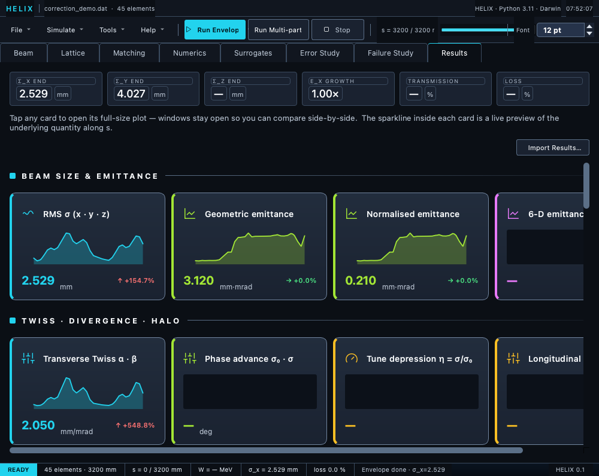

# Results tab

The Results tab is your post-tracking dashboard.  After a run,
diagnostic data is grouped into "tiles" (cards) by topic; click any
tile to open a popup with the full plot + numerical summaries.
Popups stay open side-by-side for comparison.

Nearly every tile carries a live **sparkline thumbnail** and an
**end-value + trend** footer.  Most read a recorded array directly;
the rest derive their series (cumulative phase advance, per-cell
tune depression and Hofmann ratio from the probe, dispersion and
σ(Δp/p) from the Σ-matrix, beam power, centroids) — and the
**LATTICE PARAMETERS** tiles read the loaded lattice itself, so they
render before any run and update when the lattice changes.  A tile
shows "—" only when its quantity genuinely doesn't exist yet: the
per-cell tune tiles need a probe-bearing run *and* a declared
periodic structure (an aperiodic whole line has no tune), the halo /
IBS / stripping tiles need a multi-particle H⁻ run, and the
phase-space / field-map / matrix tiles have no 1-D curve to preview.
The footprint tile stays plain until you compute one in its popup.



*Results tab after an envelope run — KPI strip on top, tile sections with live sparklines below.*

## KPI strip

Across the top, six always-visible KPI cards summarise the latest
run at a glance: **σ_x end**, **σ_y end**, **σ_z end** (mm),
**ε_x growth**, **transmission** (%), and **loss** (%).

## Import Results…

The **Import Results…** button loads a previously saved run — a
HELIX-native `.h5` or an openPMD `.opmd.h5` (auto-detected) — and
feeds it through the same path a live simulation uses, so the KPI
cards, sparklines, and every popup re-populate from the on-disk
arrays.  The file dialog opens in the configured calculation
directory, where every run's auto-saved dumps land (see
[Running → GUI](../06_running/05_gui.md)).

## Tile sections

Nine section headers, top to bottom:

* **BEAM SIZE & EMITTANCE** — RMS σ (x · y · z), geometric
  emittance, normalised emittance, 6-D emittance.
* **TWISS · DIVERGENCE · HALO** — transverse Twiss α · β, phase
  advance σ₀ · σ, tune depression η = σ/σ₀, **Hofmann stability
  chart**, **tune footprint (frozen SC)**, longitudinal Twiss,
  divergence σ_x' · σ_y', peak excursion X / Y_max, halo parameter
  H_x · H_y.  The phase-advance and tune-depression popups plot the
  **channel tunes** (σ_model, primary) with the beam Δμ_rms as a
  secondary series; the Hofmann and footprint tiles are the two
  space-charge diagnostics described below.
* **ENERGY · KINEMATICS** — energy · γ · transmission, beam power,
  4-D invariant ε_4D, eigenemittances ε₁ · ε₂ · ε₃.
* **LOSSES · TRANSMISSION** — loss profile, aperture-profile
  losses, intra-beam stripping (H⁻), magnetic stripping (H⁻), and
  the error-study ensemble tile.
* **CENTROID · DISPERSION** — centroid ⟨x⟩ · ⟨y⟩ · ⟨φ⟩,
  longitudinal offset Δφ_s · ΔW_s, dispersion D_x · D_y, and
  **σ(Δp/p) along s** (the momentum-spread plot; see
  [σ(Δp/p) tile](#momentum-spread-tile) below).
  The dispersion popup plots the **statistical** dispersion of the
  tracked beam — `D_u = ⟨u·δ⟩/⟨δ²⟩` from the Σ-matrix cross terms,
  which includes space charge and any seeded input dispersion — and a
  **Transfer-matrix model** checkbox overlays (dashed) the dispersion
  of the lattice itself: the unit energy-offset ray propagated by the
  element transfer matrices, seeded from the Beam tab's input
  dispersion, computed in a background worker (field-map matrices are
  RK4-integrated on first use, so the first overlay on a long linac
  takes tens of seconds; later toggles are instant).  On a static,
  space-charge-free line the two curves coincide exactly — where they
  split, the difference is beam physics (space charge, nonlinearity),
  not machine optics.
  When the loaded lattice carries **diagnostic-matching targets**
  (`DIAG_POSITION` operands or a loaded BPM-targets file), the
  centroid popup overlays the **goal orbit** as hollow points at each
  BPM and a banner reports the achieved-vs-goal rms gap per plane —
  the direct "how close are we to what the diagnostics asked for"
  view.  Envelope results carry a real first moment too, so the same
  achieved-vs-goal banner appears for both tracking modes; only
  results from sources that genuinely carry no centroid (e.g. loaded
  archives) fall back to a note saying so.

Every popup carries a **live match preview** checkbox (top-right, off
by default).  Ticked, the popup re-plots the Matching tab's *current
iterate* about once per second while an optimization runs — watch the
orbit walk onto the goal points as the fit converges — and its title
shows `LIVE match iter N`.  When the match ends the popup snaps back to
the committed results.  Unticked popups ignore the stream entirely.
This is separate from end-of-run refresh, which is always on: every
visible popup updates whenever a normal run completes, regardless of
the checkbox.
* **PHASE SPACE · DIAGNOSTICS** — **Phase space (4-panel)** (the
  full phase-space view at any snapshot marker), density-vs-s
  heatmap, BPMs, field-map viewer (2D + cuts), cavity TTF T(β).

    The phase-space popup's **Beam parameters** toggle (2026-07) swaps
    the four density panels for a full parameter table of the
    *selected* distribution — location, species/mass/charge, beam
    current, reference particle (s, W_kin, β, γ, βγ, φ_s), centroid,
    RMS sizes (incl. derived σ_z and σ_δ), Twiss for **all three
    planes** (α_z/β_z in the internal (Δφ, ΔW) convention — α_z =
    −TraceWin's, β_z in deg/MeV), geometric / normalized / 4-D /
    eigen-emittances, Wangler halo, and per-coordinate max extents.
    The table follows the location selector, and ++ctrl+s++ exports it
    like any other popup data.
* **LATTICE PARAMETERS** — per-element field/optics scalars read off the
  lattice itself; see [Lattice-parameter field plots](#lattice-params) below.
* **CROSS-CHECKS · COMPARE** — compare with TraceWin partran
  output.
* **ADVANCED · MATRIX VIEWERS** — Σ matrix (6×6), transfer matrix
  (6×6), SC convergence.  These three cards don't open popups of
  their own: the Σ-matrix and transfer-matrix cards route to the
  **Tools → Show Sigma Matrix… / Show Transfer Matrix…** dialogs,
  and the SC-convergence card jumps to the
  [Numerics tab](04_convergence_tab.md), where the convergence
  scans live.

## Raw vs Dispersion-corrected toggle {#raw-vs-dispersion-corrected}

Six popups expose a **Display** dropdown at the top with two
options:

* **Raw (includes dispersion)** — the σ-matrix entry as recorded.
  In dispersive regions (arcs, RF-coupled sections, solenoid HWR /
  SSR cryomodules with non-zero Σ[i,5] cross terms) this includes
  the dispersive contribution `D · σ_δ`.
* **Dispersion-corrected (betatron only)** — the pure-betatron
  part, obtained by subtracting the Schur complement on the
  σ-matrix energy block:

  ```text
  Σ_β,ii = Σ_ii − Σ_i5² / Σ_55
  Σ_β,ij = Σ_ij − Σ_i5 · Σ_j5 / Σ_55
  ```

  From these, σ_x,β = √Σ_β,(0,0), ε_x,β = √(Σ_β,(0,0)·Σ_β,(1,1) − Σ_β,(0,1)²),
  α_x,β = −Σ_β,(0,1)/ε_x,β, β_x,β = Σ_β,(0,0)/ε_x,β.

**Which popups carry the toggle**:

| Popup | Raw display | Dispersion-corrected display |
|---|---|---|
| RMS σ (σ_x, σ_y) | recorded `sigma_x`, `sigma_y` | √Σ_β,(0,0), √Σ_β,(2,2)  (σ_φ stays raw — already in the energy plane) |
| Emittance (ε_x, ε_y, ε_t 4-D) | recorded `emit_x`, `emit_y`, `emit_4d` | √det(Σ_β,2×2) per plane, √det(Σ_β,4×4) for 4-D  (ε_z stays raw) |
| Normalised emittance | `emit_nx`, `emit_ny` | ε_β · (βγ) per plane |
| Twiss (α, β) | `alpha_x`, `beta_x`, `alpha_y`, `beta_y` | α_β, β_β from Σ_β,2×2 |
| Divergence (σ_x', σ_y') | √Σ_11, √Σ_33 | √Σ_β,(1,1), √Σ_β,(3,3) |
| Peak excursion (X_max, Y_max) | particle-tracked x_max / fallback 5·σ_x | fallback path uses 5·σ_β; MP-tracked x_max is the raw truth in both modes |

**When to use each**:

* **Raw** for aperture / loss studies — what actually hits the wall.
* **Dispersion-corrected** for matching diagnostics — the design β·ε
  comparison only holds for the pure-betatron part.  In any
  dispersive section the raw σ disagrees with the design β by the
  dispersion-induced inflation; the corrected view removes it so the
  measured optics matches the design intent.

**Edge case — DC beam / zero energy spread**: when Σ[5,5] ≤ ε, the
dispersive contribution is zero by construction, so the helper
returns the raw entries unchanged.  No NaN, no zero-division.

**Cross-references**:

* [`σ(Δp/p) tile`](#momentum-spread-tile) — the related plot of the
  beam's momentum spread along s; the same σ_W and reference
  β, γ that go into the σ(Δp/p) tile drive the Schur-complement
  correction here.
* [Dispersion (D_x · D_y) popup](#) — explicit dispersion functions;
  the disp-corrected σ_x and Dispersion together let you read off
  the dispersive contribution σ_x² − σ_x,β² = D_x²·σ_δ² for
  internal-consistency checks.

## σ(Δp/p) tile — RMS momentum spread along s {#momentum-spread-tile}

Computed from the recorded RMS energy spread `σ_W(s)` and the
reference particle's β, γ:

```
σ(Δp/p) = σ_W / (β² · γ · m₀c²)
```

This is the inverse of the conversion the **Dispersion D_x/D_y**
tile applies internally, so the two are mathematically consistent.

**Typical values** for a proton beam in the PIP-II energy range
(σ_W ≈ 10 keV at 2-10 MeV): σ(Δp/p) of order **10⁻³ to 10⁻⁴**.

**What to look for**:

* **Adiabatic damping through accelerating sections**: as the beam
  picks up energy, β²γ·m₀c² grows, so σ(Δp/p) *shrinks* even
  though σ_W stays roughly constant.  A jump in σ(Δp/p) at a
  cavity boundary indicates real longitudinal mismatch (not just
  acceleration).
* **Longitudinal acceptance** for downstream RF buckets — the
  acceptance is usually quoted in dp/p, not σ_W; this plot lets
  you read it off directly.
* **Dispersion-driven beam size**: in arcs (BTL), σ_x picks up a
  contribution `D_x · σ(Δp/p)`; reading both off their respective
  tiles tells you whether dispersion or betatron motion dominates.

**Source**: `_DpPRmsPopup` in `gui/linac_gen_gui/interphase/tabs/results_tab.py`
(uses the same `sigma_w` / `ref_beta` / `ref_gamma` / `mass_mev`
fields as the Dispersion popup, with the same fallback for
`mass_mev` when it's not in the results).

## Space-charge diagnostics — Hofmann chart & tune footprint {#sc-diagnostics}

Two tiles in **TWISS · DIVERGENCE · HALO** open the space-charge
diagnostics built on the channel tunes (full theory:
[Hofmann chart & tune footprint](../09_diagnostics/07_hofmann_footprint.md)):

* **Hofmann stability chart** — the per-cell (k_z/k_x, k_x/k_0x)
  trajectory over the anisotropy-resonance chart, with resonance lines at
  k_z/k_x = m/n and *indicative* bands at the median depression.  It reads
  the pre-computed phase-probe maps, so it refreshes instantly.

For **multi-particle results** (no probe maps), the tune-depression popup
offers a **Compute channel model** button — a companion envelope probe at
the current Beam-tab config that fills the model curves next to the MP
beam markers; the Hofmann chart reuses the same cached probe.
* **Tune footprint (frozen SC)** — press **Compute footprint** to re-track
  the selected cell **off-thread** with a frozen matched-beam field; the
  scatter shows each particle's (μ_x, μ_y) coloured by launch amplitude,
  with the core tune and spread in the caption.

## Lattice-parameter field plots {#lattice-params}

The **LATTICE PARAMETERS** section plots a single scalar per element, read
from the **lattice** (design values) rather than the tracked beam — one stem at
each element's mid-point. Each shows a centred "no data" message when the
lattice has no element of that type.

| Tile | Quantity | Elements | Units |
|---|---|---|---|
| Quadrupole gradient | `G` | quads | T/m |
| Quadrupole ∫G·ds | `G·L` | quads | T |
| RF voltage (V₀) | `\|ke\|·∫\|E_z\|dz/\|norm\|` (or lumped `voltage`) | RF gaps, cavity field maps | MV |
| Peak E_acc | peak axial accelerating gradient | cavity field maps | MV/m |
| Peak solenoid \|B_z\| | on-axis peak field | solenoids, magnetic field maps | T |
| **Solenoid ∫B²·dz** | **integrated B_z² — focusing strength** | **solenoids, magnetic field maps** | **T²·m** |
| Dipole field \|B\| | `Bρ/\|ρ\|` (hard-edge) | dipoles (`BEND`) | T |
| Dipole ∫B·dl | `B·L = Bρ·θ` | dipoles (`BEND`) | T·m |
| Floor plan (survey) | design-trajectory geometry | whole lattice | m |
| Synchronous phase | `φ_s` | RF / field-map elements | deg |

**∫B²·dz** is the energy-independent measure of a solenoid's transverse
focusing strength: the solenoid focusing parameter is
`(1/2Bρ)²·∫B_z²·dz`, so this integral captures the lens shape independent of
beam energy. It is computed for both solenoid representations — a lumped
`SOLENOID` (hard-edge uniform field → `B₀²·L`) and a magnetic field map
(trapezoidal integral of the on-axis `B_z(z)²` profile, scaled by
`kb·scale/norm`). RF cavities (field maps with an E channel) are excluded.

The **dipole tiles** are the one lattice-parameter pair that needs the beam:
a `BEND` card stores only geometry (bend angle `θ` and curvature radius
`ρ`), so the field is `B = Bρ/|ρ|` at the **beam rigidity**. After a run
the rigidity is taken per element from the run's reference energy (exact
through accelerating sections); before any run it uses the beam-config
entrance energy — exact for fixed-energy transfer lines. Without a beam
configuration the tiles show the placeholder rather than a guess. Since
`θ` is fixed by the card, `∫B·dl = Bρ·θ` — the field-integral tile is the
design invariant that stays constant when a dipole is shortened at fixed
bend angle.

**Floor plan (survey)** walks the reference orbit through the lattice in
3-D and draws the design trajectory: a top view (`x`–`z`, aspect-locked,
horizontal dipole arcs highlighted) and a side view (`y` vs path length
`s`, vertical dipole arcs highlighted), with entrance/exit markers and a
summary line (path length, Σ|θ|, dipole counts, exit coordinates). Pure
lattice geometry — no run required; a straight lattice draws a straight
line. Sign conventions: positive horizontal bend angle curves toward
`+x`, positive vertical angle (`hv=1`) toward `+y`; MAD-style negative
drifts step backward.

## Popup details

Each tile popup shows:

* The plot (zoomable, toggle log/linear).
* An optional **lattice-element strip** along the s-axis — a
  colour-coded impression of the lattice, toggled by a checkbox and
  drawn without obscuring the curves.
* A numerical summary at top (means, ranges, percentile values).

**Saving from a popup**: press **Ctrl+S** or right-click for the
context menu ("Save plot…  (Ctrl+S)") — there are no dedicated save
buttons.  One dialog covers both data and image exports: pick a
data format (**CSV / NumPy .npz / JSON / HDF5**) to write the
plotted arrays, or an image format (PNG / JPEG / SVG / PDF) for the
figure itself.  **Ctrl+W** or **Esc** closes the popup.

## Tile availability

The tile grid is static — every card is always shown, and cards
whose data is missing simply open an empty/"no data" view.  The one
exception is **Intra-beam stripping (H⁻)**: the card is disabled
unless the beam species is H⁻, and its tooltip explains how to
switch (Beam tab → Species → H- → Apply).  Eigenemittances are
always recorded — there is no flag to enable them.  The error-study
ensemble popup fills only after an Error Study run, and the
phase-space popup needs snapshot markers (or Numerics → "Snapshot
every N") to have data.

## Exporting to openPMD

The toolbar's **Export openPMD output…** action writes the most
recent run to an openPMD-1.1 HDF5 file (`*.opmd.h5`) — a portable
interchange format readable by openPMD-aware tools.  See
[Reading results → openPMD](../06_running/04_results.md#openpmd-interchange-format).

## Cross-references

* [Recorder fields](../09_diagnostics/01_recorder.md)
* [Reading results](../06_running/04_results.md)

← [Failure Study tab](06c_failures_tab.md) ·
[Continue to Workflows →](08_workflows.md)
